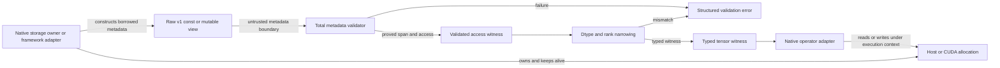

# Native Tensor View ABI Reference Architecture

**Scope:** Define the first independently implementable slice of `ROADMAP.md` item 1: a versioned, borrowed, PyTorch-free tensor-view data ABI, its C++ validation boundary, and its host-only conformance tests for the native Windows backend.
**Security Classification:** High
**Audience:** C++ and CUDA implementers building the native Windows Qwen3.8 serving backend and reviewers responsible for ABI, memory-safety, and CUDA-lifetime correctness.
**Prerequisites:** `AGENTS.md`, `ROADMAP.md`, `notes/current-state.md`, and `python/sglang/kernels/README.md`.
**Related Documentation:** [benchmark contract](https://github.com/danielchristiancazares/sglang/blob/main/notes/benchmark-contract.md), [Windows production launcher](https://github.com/danielchristiancazares/sglang/blob/main/scripts/windows/serve_qwen38_27b_nvfp4_5090.ps1), [test system](https://github.com/danielchristiancazares/sglang/blob/main/test/README.md), [Mintlify hidden pages](https://www.mintlify.com/docs/organize/hidden-pages), and [DLPack C API](https://github.com/dmlc/dlpack/blob/main/include/dlpack/dlpack.h).

This document fixes the lowest dependency in the native-backend roadmap: the representation that native owners, adapters, execution plans, and kernels use to describe borrowed tensor memory. It defines a fixed-layout v1 metadata record, separate read-only and mutable views, exact dtype and device identifiers, checked affine-stride bounds validation, conservative mutable-alias rejection, typed narrowing, structured errors, and standalone MSVC/NVCC verification. The slice remains dormant with respect to the SRT server. Allocation, stream and event ownership, graph-stable arenas, framework adapters, operator contracts, kernels, model execution, and serving integration consume this ABI through separately authorized slices.

**Normative Language:** The key words MUST, MUST NOT, REQUIRED, SHALL, SHALL NOT, SHOULD, SHOULD NOT, RECOMMENDED, MAY, and OPTIONAL are to be interpreted as described in RFC 2119 and RFC 8174 when, and only when, they appear in all capitals.

## Table of Contents

1. [Overview](#1-overview)
2. [Functional and Non-Functional Requirements (NFRs)](#2-functional-and-non-functional-requirements-nfrs)
3. [Key Invariants and Assumptions Audit](#3-key-invariants-and-assumptions-audit)
4. [Responsibilities and Scope Boundaries](#4-responsibilities-and-scope-boundaries)
5. [Security and Threat Model](#5-security-and-threat-model)
6. [Privacy and Data Minimization](#6-privacy-and-data-minimization)
7. [Key Concepts](#7-key-concepts)
8. [Architecture](#8-architecture)
9. [Type Safety Model and API Contracts](#9-type-safety-model-and-api-contracts)
10. [Control Flow](#10-control-flow)
11. [Data Model](#11-data-model)
12. [Error Handling](#12-error-handling)
13. [Concurrency, Lifetimes, Robustness, and Resource Management](#13-concurrency-lifetimes-robustness-and-resource-management)
14. [Configuration](#14-configuration)
15. [Dependencies and Supply-Chain Risks](#15-dependencies-and-supply-chain-risks)
16. [Common Patterns](#16-common-patterns)
17. [Common Issues](#17-common-issues)
18. [Verification Coverage](#18-verification-coverage)
19. [Debugging and Observability](#19-debugging-and-observability)
20. [Performance, Scalability, and Robustness Analysis](#20-performance-scalability-and-robustness-analysis)
21. [Compatibility, Deployment, and Migration Boundaries](#21-compatibility-deployment-and-migration-boundaries)
22. [Alternatives Considered](#22-alternatives-considered)
23. [Related Documentation and Source References](#23-related-documentation-and-source-references)

## 1. Overview

### Intent

Establish one PyTorch-, TVM-, and Python-independent tensor-view contract that every dependent native Windows runtime slice can consume without redefining dtype, rank, stride, access, bounds, or error semantics.

### Work classification

This work is a **foundational internal ABI and memory-safety boundary**. It is the first independently implementable part of the roadmap instruction to freeze native ABI and tensor descriptors before kernels and execution plans (`ROADMAP.md:806-813`). Its security classification is High because malformed raw pointers, capacities, offsets, extents, or strides can otherwise become out-of-bounds GPU or host accesses once a kernel consumes the view.

### Evidence establishing the boundary

- The target architecture is a native Windows backend alongside SRT, with C++ owning the engine and Cut 4 removing PyTorch (`ROADMAP.md:1-10`, `ROADMAP.md:778-794`).
- The roadmap names a native tensor/view descriptor and explicit dtype/layout/stride contracts as prerequisites for replacing the PyTorch substrate (`ROADMAP.md:326-365`).
- Native compute islands still receive tensors through Python-owned wrappers and a framework tensor ABI (`ROADMAP.md:636-655`).
- The JIT tensor validator accepts `tvm::ffi::TensorView`, includes DLPack and TVM headers, and reports validation failures with C++ exceptions (`python/sglang/kernels/jit/include/sgl_kernel/tensor.h:15-17`, `python/sglang/kernels/jit/include/sgl_kernel/tensor.h:478-582`).
- The accompanying blob helpers construct TVM tensors through unversioned `DLManagedTensor` transfer (`python/sglang/kernels/jit/include/sgl_kernel/ffi.h:4-7`, `python/sglang/kernels/jit/include/sgl_kernel/ffi.h:48-103`).
- The AOT kernel build locates Python and Torch and produces Python modules, so it cannot define the dependency floor for the PyTorch-free engine (`python/sglang/kernels/aot/CMakeLists.txt:20-45`, `python/sglang/kernels/aot/CMakeLists.txt:328-354`).
- Graph-stable pointer identity and stream handoff are separate responsibilities in the SRT graph registry (`python/sglang/srt/model_executor/cuda_graph_buffer_registry.py:265-277`, `python/sglang/srt/model_executor/cuda_graph_buffer_registry.py:314-360`). The native descriptor therefore carries memory geometry and access only; graph stability and stream ordering use distinct owner/context types.
- Native NVFP4 producers expose packed writable output as `uint8_t` at half logical width, and repository CUDA code packs the lower-index value into the low nibble (`python/sglang/kernels/jit/csrc/gemm/silu_and_mul_nvfp4.cuh:138-153`, `python/sglang/kernels/jit/csrc/deepseek_v4/main_norm_rope.cuh:800-801`). This evidence governs v1 nibble order and the specialized mutable-byte boundary.

### Architectural decisions

| Aspect | Required approach | Rationale |
|---|---|---|
| Delivery unit | A dormant descriptor, validator, typed narrowing layer, and standalone tests | It is useful to every dependent native slice and introduces no server consumer. |
| Source location | `native/include/sglang/native`, `native/src`, and `native/test` | The native backend is a repository peer of SRT and has no Python package ownership. |
| Binary boundary | Fixed-width, standard-layout, trivially copyable v1 C-compatible records | MSVC DLL and CUDA translation units can exchange the records without standard-library ABI exposure. |
| Ownership | Every v1 view is borrowed | Allocation and reclamation remain owner responsibilities; a descriptor never transfers or extends lifetime. |
| Access | Distinct const and mutable raw-view types | Mutability is explicit in the type accepted by an operator. |
| Layout | Rank-bounded affine striding in logical elements | Shape and stride semantics are complete for ordinary dense and packed affine views. |
| Validation | Total, deterministic, `noexcept`, allocation-free validation before pointer exposure | Malformed metadata becomes structured failure without dereference or CUDA activity. |
| Typed use | Raw views validate into opaque witnesses and narrow into compile-time dtype/rank views | Conforming operator signatures accept typed witnesses and never raw ABI records. |
| Streams | No stream field in the tensor record | Stream ordering belongs to the execution context for an operation, not to the memory view. |
| Graph stability | No graph-stability flag in the tensor record | The graph-arena architecture produces a distinct graph-stable witness backed by an owner with stable address and lifetime. |
| Framework exchange | DLPack, TVM, and Torch conversions are adapter responsibilities outside this slice | The core ABI stays independent of framework ownership and release protocols. |
| Production behavior | The launcher, SRT dispatch, kernels, endpoints, outputs, and qualification contract remain unchanged | The slice has no production registration or call site. |

### Required outcome

Two conforming implementations produce the same field layout, numeric identifiers, validation result, error code, access decision, computed storage span, and typed-narrowing result for every readable 192-byte v1 record on Windows x64. Any implementation that lets an operator consume a raw ABI record, exposes a logical-origin pointer through the witness API after failed validation, embeds a framework object, performs CUDA work during validation, or changes SRT behavior is non-conforming.

## 2. Functional and Non-Functional Requirements (NFRs)

### Functional requirements

- **[REQ-1] Fixed ABI.** `tensor_view.h` MUST define the v1 metadata and view records with the field offsets and sizes in Section 8. The ABI-visible surface MUST use fixed-width integer types, fixed arrays, and raw pointers only.
- **[REQ-2] Inline geometry.** A v1 record MUST carry rank, extents, and strides inline. Rank MUST be in `[0, 8]`. Metadata lifetime MUST NOT depend on caller-owned shape or stride arrays.
- **[REQ-3] Exact scalar vocabulary.** The dtype identifiers and element widths in Section 8 MUST be the only accepted v1 values. Unknown values MUST return `kUnknownDType`.
- **[REQ-4] Exact memory-space vocabulary.** The device identifiers and ordinal rules in Section 8 MUST be the only accepted v1 values. Validation MUST remain a metadata check and MUST NOT query a CUDA device or pointer attribute.
- **[REQ-5] Borrowed access types.** `SglNativeConstTensorViewV1` MUST contain `const void*`; `SglNativeMutableTensorViewV1` MUST contain `void*`. Neither type owns storage or contains a deleter.
- **[REQ-6] Checked span.** Validation MUST use checked integer arithmetic to prove that every reachable logical element lies inside `[allocation_base, allocation_base + allocation_bytes)`.
- **[REQ-7] Affine layout.** Strides MUST be expressed in logical elements. Negative extents and negative strides MUST be rejected. Read-only views MAY overlap. Mutable views over byte-addressable dtypes MUST satisfy the conservative non-overlap proof in Section 8.
- **[REQ-8] Empty and scalar semantics.** Rank-zero tensors MUST represent one scalar element. Any active zero extent MUST represent an empty tensor. Empty views MUST follow the null-base and offset rules in Section 8.
- **[REQ-9] Packed element semantics.** `kNvFp4E2M1` MUST have a four-bit logical element width. Its logical origin MUST be byte-aligned. Bound checks MUST operate in bits and round the final occupied span upward to bytes. Generic mutable validation MUST reject every sub-byte dtype; packed outputs use mutable byte storage inside a specialized layout witness.
- **[REQ-10] Typestate validation.** A raw view MUST validate into either a `Validated*TensorView` witness or a `TensorValidationError`. The result type MUST require handling both states. Validated and typed witness constructors MUST be inaccessible to ordinary callers.
- **[REQ-11] Typed narrowing.** The C++ witness API MUST expose a logical-origin pointer only after validation and a dtype/rank narrowing step. Constness MUST propagate to the exposed byte pointer. Operator APIs MUST NOT accept raw ABI records or read `allocation_base` directly.
- **[REQ-12] Structured failure.** Every malformed descriptor stored in a readable record MUST return one stable error code from Section 12. Validation MUST be `noexcept`, MUST NOT allocate, and MUST NOT throw, assert, terminate, log, dereference tensor data, or invoke CUDA.
- **[REQ-13] CUDA compilation.** The C ABI header and C++ wrapper header MUST compile in an MSVC C++20 translation unit and an NVCC CUDA C++20 translation unit using the repository's Windows toolchain initialization.
- **[REQ-14] Dependency isolation.** Files under `native/` in this slice MUST NOT include or link Python, PyTorch, ATen, c10, TVM, DLPack, FlashInfer, or TRT-LLM.
- **[REQ-15] Dormant integration.** This slice MUST NOT register an operator, alter a launcher, load a DLL into SRT, change a Python import, or create a runtime dispatch branch.
- **[REQ-16] Governing implementation language.** Runtime and test implementation added for this slice MUST be C++ or CUDA. No Python source may be added (`AGENTS.md:1-3`).
- **[REQ-17] Canonical initialization.** The C++ wrapper MUST provide a `constexpr`, `noexcept` metadata initializer that zeroes every byte, sets `struct_size` to 184, and sets ABI version 1.0. Production owners and adapters MUST begin metadata construction with this initializer.

### Non-functional requirements

| Category | Requirement | Target | Measurement | Evidence / Verification |
|---|---|---:|---|---|
| ABI stability | Layout is identical across conforming MSVC settings | Metadata `184` bytes; each view `192` bytes; alignment `8` | `sizeof`, `alignof`, and `offsetof` static assertions under default packing and `/Zp1` | `native/test/tensor_view_test.cpp` ABI cases |
| Memory safety | Invalid geometry never yields a pointer-bearing witness | 100% of rejected cases | Error-code matrix, boundary cases, deterministic malformed-input property run | Section 18 matrix |
| Arithmetic safety | Span calculations never wrap | 100% checked add/multiply operations | Maximum-value and one-past-boundary tests | `ArithmeticOverflow*` and `OutOfBounds*` cases |
| Dependency isolation | Core compiles without framework headers or libraries | Zero prohibited includes and links | Direct `cl.exe` and `nvcc.exe` builds plus source scan | Section 18 commands |
| Allocation behavior | Validation and narrowing allocate no host or device memory | Zero allocations | Test-scoped global allocation counter and absence of CUDA calls | `ValidationDoesNotAllocate` |
| Concurrency | Validation has no mutable global state | Thread-safe concurrent calls | Static review and multi-thread determinism test | `ConcurrentValidationIsDeterministic` |
| Observability privacy | Diagnostics expose no addresses or tensor contents | Zero pointer/content fields in formatted errors | Golden diagnostic tests and source review | `ErrorsRedactAllocationAddress` |
| Runtime performance | Replay loops perform no descriptor validation | Zero validation calls per graph replay | First-consumer integration counter | Integration gate in Section 20 |
| Compatibility | Qualified SRT behavior is preserved | Exact launcher and endpoint behavior unchanged | Worktree diff proves no production files are touched; runtime consumers run full gates | Section 21 |
| Portability | Scope is explicit | Windows x64, little-endian, MSVC ABI, CUDA C++20 | Compile-time platform assertions | `PlatformContractIsExplicit` |

## 3. Key Invariants and Assumptions Audit

### Key invariants

| ID | Invariant | Enforcement mechanism | Verification method | Responsible component |
|---|---|---|---|---|
| INV-1 | No conforming operator consumes a raw view or reads its base pointer. | Operator signatures accept typed witnesses; raw records are confined to owners, adapters, validator implementation, and tests. | API inventory, source scan, and positive typed-narrowing tests | `tensor_view.hpp` and operator reviewers |
| INV-2 | A validated non-empty view's complete addressed span lies inside its declared allocation. | Checked bit-span algorithm in Section 8 | Exact-fit, one-bit-over, large-stride, and overflow tests | `tensor_view.cpp` |
| INV-3 | Metadata is self-contained for rank up to eight. | Inline arrays and zeroed unused dimensions | ABI layout and unused-dimension tests | `tensor_view.h` |
| INV-4 | ABI interpretation is deterministic. | Exact version, size, reserved-zero, dtype, device, and rank rules | Byte-pattern and repeated-validation tests | Validator |
| INV-5 | A mutable validated view uses byte-addressable storage and has a provably non-overlapping affine layout. | Sub-byte rejection plus sorted-stride proof for every dimension with extent greater than one | transpose, padding, broadcast, sub-byte, and overlap cases | Mutable validator |
| INV-6 | A const validated view may represent overlapping reads while remaining in bounds. | Const-specific validation path omits the mutable overlap gate | zero-stride broadcast test | Const validator |
| INV-7 | A view never owns, frees, pins, records, or synchronizes storage. | No deleter, owner, stream, event, or callback fields; no CUDA dependency | Layout assertions, include scan, and source review | ABI and validator |
| INV-8 | Stream ordering is an operation-level concern. | Tensor records have no stream field; operator APIs receive an execution context separately. | ABI field inventory | Architecture owner |
| INV-9 | Graph-stable eligibility requires an owner-backed witness. | No graph flag exists in v1; graph arenas alone construct the graph-stable type. | ABI field inventory and consumer review | Graph arena slice |
| INV-10 | Validation failure is side-effect free. | `noexcept`, no logging, no allocation, no dereference, no CUDA calls | allocation counter, diagnostic tests, source scan | Validator |
| INV-11 | Constness survives every conversion. | Separate C records and access-parameterized C++ witnesses | compile-time type assertions | C++ wrapper |
| INV-12 | Unknown identifiers fail closed. | Exhaustive switch with explicit unknown result | unknown dtype/device tests and warning-as-error build | Validator |
| INV-13 | Pointer values and tensor contents do not enter diagnostics. | Structured errors contain codes, safe scalar facts, and dimension index only | golden error formatting | Error formatter |
| INV-14 | SRT and non-Windows behavior are unchanged. | No consumer, registration, launcher edit, or upstream dispatch edit | path-level diff review | Integrator |
| INV-15 | Protected CUDA compatibility headers remain byte-identical. | They are outside the affected file set | Checksum verification for any CUDA slice that touches adjacent code | Integrator; governing rule at `AGENTS.md:205-213` |

### Assumptions register

| ID | Assumption | Evidence / validation | Risk if false | Consequence when violated |
|---|---|---|---|---|
| ASM-1 | Native Windows engine processes are 64-bit and little-endian. | The selected lane uses native Windows on the RTX 5090; the ABI test asserts `_WIN64`, `sizeof(void*) == 8`, and `std::endian::native == little`. | ABI field layout or scalar encoding differs. | Compilation fails; no artifact is produced. |
| ASM-2 | Rank eight covers the base affine views admitted by this ABI. | The roadmap's active Qwen tensors are model, cache, metadata, and graph buffers; v1 deliberately rejects higher rank. | An operator requires a higher-rank affine view. | That operator uses a distinct higher-version descriptor; v1 meaning remains unchanged. |
| ASM-3 | Owners can provide the allocation base and accessible byte capacity. | Native allocation and pool owners are distinct roadmap responsibilities (`ROADMAP.md:261-286`, `ROADMAP.md:810-831`). | An adapter knows only an interior pointer. | The adapter cannot construct v1 safely and returns an adapter error. |
| ASM-4 | Device-pointer liveness and provenance are owner invariants. | Metadata-only validation cannot prove CUDA allocation state without context creation or runtime calls. | A caller supplies a stale or forged pointer with plausible bounds. | Use is prohibited; owner and adapter tests must prevent construction. Risk R-3 is assigned to the storage-owner architecture and blocks consumers lacking that control. |
| ASM-5 | Specialized blocked or swizzled layouts need operator-specific wrappers. | Shape and affine stride do not fully describe every ModelOpt or vendor layout. | A specialized weight is mislabeled as ordinary affine storage. | The adapter must expose opaque byte storage and a dedicated layout witness in its own slice. |
| ASM-6 | Validation occurs when a view enters an owner, adapter, plan, or capture binding. | The graph registry already separates stable allocation from per-replay use (`python/sglang/srt/model_executor/cuda_graph_buffer_registry.py:314-360`). | A consumer validates on every replay. | The consumer fails the zero-replay-validation requirement. |
| ASM-7 | A non-null pointer passed to `validate` addresses a live, aligned, readable raw record for the complete call. | C++ cannot prove arbitrary pointer readability before loading the record. Owners and adapters pass addresses of local or owner-held records; external numeric addresses are never accepted. | Validator faults while reading the record itself. | Caller violates the API precondition; public boundaries reject pointer-valued descriptor input. |

The assumptions are contract boundaries. None is an unresolved implementation choice.

## 4. Responsibilities and Scope Boundaries

### Responsibilities

The slice owns:

1. stable v1 field layout and numeric constants;
2. const and mutable borrowed-view distinctions;
3. dtype width and natural-alignment facts;
4. device-kind and ordinal validation;
5. rank, extent, stride, offset, capacity, arithmetic, and overlap validation;
6. structured validation errors and privacy-safe names;
7. validated and typed C++ witness construction;
8. standalone MSVC and NVCC conformance coverage;
9. documentation of adapters and owners as consumer boundaries.

### Required implementation file set

| Path | Responsibility | Required contents |
|---|---|---|
| `docs/NATIVE_TENSOR_VIEW_ABI.md` | Governing reference architecture | This complete contract with `hidden: true`; no `docs.json` navigation entry |
| `native/include/sglang/native/tensor_view.h` | ABI-visible records and numeric constants | C-compatible declarations, MSVC packing protection, platform-neutral fixed-width fields, no implementation logic |
| `native/include/sglang/native/tensor_view.hpp` | C++ type-safety surface | scoped enums, error types, outcome visitor, validated witnesses, typed narrowing declarations, compile-time ABI assertions |
| `native/src/tensor_view.cpp` | Validation implementation | total checked-arithmetic and overlap algorithms, safe error names, no framework or CUDA calls |
| `native/test/tensor_view_test.cpp` | Host conformance executable | ABI, validation, typestate, allocation, determinism, robustness, and diagnostic tests using a C++ test main |
| `native/test/tensor_view_cuda_compile_test.cu` | CUDA translation-unit compatibility | compile-time include, constants, type traits, and a trivial device-side metadata read; no GPU execution |

The implementation MUST use these paths and responsibilities. It MUST NOT introduce a Python wrapper, CMake target, PowerShell script, DLL registration, or server consumer in this slice. `ROADMAP.md` and every cited source are evidence-only inputs and MUST remain unchanged by this slice. The direct compiler commands in Section 18 are the canonical build entry for this bounded unit. A native build-system architecture may compile the same sources.

### Responsibilities outside this scope

- owning host, pinned-host, device, pooled, or mapped storage;
- allocation IDs, generations, stale-handle detection, and reclamation;
- CUDA streams, events, synchronization, capture, graph instantiation, or replay;
- graph-stable arenas and per-cycle output rings;
- DLPack, TVM, Torch, FlashInfer, TRT-LLM, or checkpoint adapters;
- operator-specific layout, vector-alignment, alias-between-arguments, and shape-relation contracts;
- tensor copies, casts, kernels, model execution, scheduling, loading, tokenization, parsing, HTTP, or process lifecycle;
- persistence, serialization, IPC, network transport, or public API exposure;
- production launcher changes and full-model qualification.

### Governing constraints restated for this scope

- Runtime and test code MUST be C++ or CUDA; no Python source may be added (`AGENTS.md:1-3`).
- The qualified SRT path, non-Windows paths, launcher defaults, and opt-in behavior MUST remain unchanged (`AGENTS.md:190-200`).
- Asynchronous CUDA lifetime obligations MUST be represented by storage owners and execution contexts; this descriptor MUST NOT imply lifetime completion (`AGENTS.md:197-200`).
- Protected CUDA compatibility headers and downloaded checkpoint artifacts MUST remain untouched (`AGENTS.md:205-211`).
- Focused tests and `git diff --check` are REQUIRED. Python compilation and PowerShell parsing apply only when those surfaces are touched; this slice touches neither (`AGENTS.md:213-215`).
- The production behavior and capacity contract remains the authority for the first runtime consumer: exact 200,000-token capacity, preserved reasoning, arithmetic, tool parsing, language-only surface, graph capture, and OpenCode2 integration (`notes/current-state.md:20-69`, `notes/current-state.md:300-318`).

## 5. Security and Threat Model

### System model and data-flow diagram



The raw-view boundary is untrusted even when all callers live in one process. Request-derived lengths, adapter bugs, stale owners, ABI skew, integer overflow, and memory corruption can all produce malformed fields. Validation establishes only metadata safety. Owner liveness, cross-argument alias policy, operation semantics, and stream ordering remain mandatory downstream controls.

### Attack paths

| Priority | Attack or failure path | Complete sequence | Impact | Detection | Treatment |
|---:|---|---|---|---|---|
| 1 | Arithmetic wrap creates an undersized span | Large extent or stride enters raw view → unchecked multiplication wraps → validator accepts → kernel addresses beyond allocation | Host/GPU memory corruption, process loss, desktop instability | Overflow test matrix and deterministic malformed-input run | Checked multiply/add in bit units; return `kArithmeticOverflow` before witness construction |
| 2 | Mutable overlap produces conflicting writes | Zero or small stride, or generic sub-byte storage, enters mutable view → multiple indices alias a logical element or physical byte → parallel kernel writes race | Nondeterminism, corrupted model state, CUDA fault | Mutable overlap and sub-byte decision-table tests | Reject generic sub-byte mutation; apply conservative sorted-stride proof to byte-addressable storage |
| 3 | Stale pointer passes geometric validation | Owner frees or recycles allocation → descriptor remains reachable → metadata validates → consuming operator dereferences stale address | Cross-request data corruption or access violation | Owner generation/lifetime tests in storage slice; CUDA sanitizers at consumer integration | Borrowed-lifetime invariant; owners alone construct long-lived views; graph/output owners retain distinct storage |
| 4 | ABI skew changes field interpretation | Caller compiles another packing/version → callee reads shifted dtype/rank/pointer | Arbitrary validation outcome and memory access | `struct_size`, version, reserved checks; `/Zp1` ABI test | Header-local `pack(push, 8)`, exact static assertions, fail-closed version policy |
| 5 | Dtype confusion changes element width | Unknown or mislabeled dtype reaches span calculation → allocation appears large enough under wrong width → kernel casts differently | Out-of-bounds access or numerical corruption | Every dtype ID and narrowing mismatch test | Closed dtype table; compile-time typed narrowing; specialized layouts use distinct witnesses |
| 6 | Diagnostic output discloses addresses | Error path formats raw allocation pointer or tensor bytes → logs become accessible | ASLR information disclosure or prompt/weight leakage | Golden diagnostic and source-scan tests | Error object omits pointer/content; formatter names only safe metadata |
| 7 | Device mismatch routes a host address to CUDA | Incorrect device kind or ordinal is accepted → CUDA operator consumes host pointer | CUDA fault or process termination | Device/ordinal tests and owner-adapter tests | Closed device table; operator requires matching execution context and owner provenance |
| 8 | Operator bypasses validation | Operator accepts a raw record or reads its public ABI base field → malformed metadata reaches pointer arithmetic → kernel launches | Same critical effects as paths 1 through 5 | Operator API inventory and prohibited-raw-type source scan | Raw records are adapter-only; every operator parameter is a typed witness |
| 9 | Raw-record pointer is unreadable | Caller passes a non-null stale or forged pointer to `validate` → validator loads metadata → host access violation | Process loss | API-boundary review and owner tests | Only trusted owners/adapters pass record addresses; no public or serialized interface accepts descriptor pointers |

### Risk register

| ID | Risk | Attack path | Likelihood | Impact | Risk treatment | Residual risk | Owner |
|---|---|---|---|---|---|---|---|
| R-1 | Bounds arithmetic defect | 1 | Low with required tests | Critical | Small checked-arithmetic implementation, full branch matrix, warning-as-error, static analysis | Implementation defect in validator | Tensor ABI maintainer |
| R-2 | Writable internal aliasing | 2 | Low | High | Generic sub-byte mutation is rejected; conservative proof rejects every byte-addressable layout it cannot prove non-overlapping | Aliasing across separate arguments remains operator-specific | Operator contract maintainer |
| R-3 | Stale or forged base pointer | 3 | Medium in descriptor-only deployment | Critical | Borrowed semantics, no persistent/IPC use, owner-only construction for retained views | Metadata validation cannot prove allocation liveness | Storage-owner maintainer |
| R-4 | Compiler or packing ABI divergence | 4 | Low | Critical | Fixed-width fields, packing guard, exact offsets, two packing builds, version/size checks | Toolchain defect outside tested MSVC/CUDA lane | Build maintainer |
| R-5 | Specialized layout mislabeled as affine | 5 | Medium at the adapter boundary | High | Dedicated wrapper requirement and per-operator layout witness | Human integration error | Model-plan maintainer |
| R-6 | Address leakage through logs | 6 | Low | Medium | Pointer-free structured errors and golden output | External crash dumps can contain addresses | Observability maintainer |
| R-7 | Device provenance mismatch | 7 | Medium at the owner/execution boundary | Critical | Closed metadata vocabulary plus owner/context matching in the execution-context architecture | Metadata alone cannot query provenance | Execution-context maintainer |
| R-8 | Raw ABI bypass | 8 | Low with API review | Critical | Operator signatures accept typed witnesses; source scans reject raw view types outside adapters/validator/tests | Deliberate unsafe cast can violate the architecture | Operator contract maintainer |
| R-9 | Unreadable raw-record pointer | 9 | Low with owner-only construction | High | No public pointer-valued input; owners pass live local/owned records | C++ cannot probe arbitrary address readability safely | Adapter maintainer |

### Risk acceptance criteria

A conformance result MUST fail when any of the following is true:

1. any invalid descriptor yields a validated or typed witness;
2. any validation operation wraps, allocates, throws, terminates, logs, dereferences data, or calls CUDA;
3. constness can be removed through the public API;
4. a mutable overlapping view passes the Section 8 proof;
5. ABI size, offset, alignment, packing, version, or numeric-ID assertions differ;
6. diagnostics contain a base address or tensor payload;
7. a prohibited framework dependency appears under the slice's `native/` paths;
8. an operator signature accepts `SglNativeConstTensorViewV1` or `SglNativeMutableTensorViewV1`, or operator code reads `allocation_base` from a raw record;
9. a public, serialized, plugin, or request interface accepts a raw descriptor pointer or numeric address.

Risk R-3 and R-7 require explicit treatment in the storage-owner and execution-context architectures as prerequisites for any native operator that consumes retained views. They are accepted only for a dormant ABI whose tests use inert, never-dereferenced addresses.

### Security controls

- **Attack surface:** In-process raw descriptor construction is the only surface. No network, file, IPC, plugin, or user-facing API is added.
- **Authentication and authorization:** Not applicable to this dormant component. Public boundaries authenticate and authorize requests before native descriptors exist.
- **Least privilege:** The validator performs metadata computation only. It has no allocator, filesystem, network, process, CUDA, or logging capability.
- **Secret management:** No credentials or secrets enter the component.
- **Audit logging:** The core validator emits no logs. Consumers MAY count error codes and operation names. They MUST redact addresses and tensor contents.
- **Fail-closed behavior:** Unknown versions, dtypes, devices, ranks, or reserved values return errors.
- **Resource exhaustion:** Work is bounded by rank eight and fixed storage. No descriptor controls allocation or loop count beyond eight dimensions.

### Risk treatment evidence and robustness acceptance criteria

| Failure mode | Pass criterion | Evidence |
|---|---|---|
| Maximum-value extent/stride arithmetic | Returns `kArithmeticOverflow`; process and sanitizer remain clean | `ArithmeticOverflowExtentStride` |
| Mutable zero-stride broadcast | Const form validates; mutable form returns `kMutableOverlap` | `ConstBroadcastAndMutableOverlap` |
| Corrupted packing/version bytes | Returns the exact ABI error and exposes no pointer | `AbiMismatchFailsClosed` |
| One million deterministic malformed records | No crash, hang, allocation, CUDA call, or nondeterministic result | `MalformedDescriptorPropertyRun` |
| Concurrent validation of shared raw bytes | Every thread returns the same immutable result | `ConcurrentValidationIsDeterministic` |

## 6. Privacy and Data Minimization

### Privacy summary

The validator processes tensor metadata and an opaque allocation address. It does not read tensor payloads. The underlying allocation may contain model weights, prompt tokens, hidden states, KV cache, recurrent state, sampled tokens, or tool content; those bytes remain outside this component's data flow. Raw addresses are sensitive operational data and receive redaction treatment.

### Data inventory

| Data | Source | Sensitivity | Retention | Permitted use |
|---|---|---|---|---|
| ABI version, dtype, device, rank, extents, strides, capacity, offset | Storage owner or adapter | Low to moderate operational metadata | Copied into a short-lived validated witness | Bounds, access, and type validation |
| Allocation base address | Storage owner or adapter | Sensitive process/GPU address | Retained only in borrowed witnesses whose lifetime is bounded by the owner | Pointer derivation after typed narrowing |
| Tensor payload | Owner allocation | Potentially confidential model or user data | Never copied or inspected by this component | Native operator only |
| Validation error code, field, dimension, safe scalar facts | Validator | Low operational metadata | Consumer-controlled counter or diagnostic | Debugging and conformance |

### Data flows and boundaries

1. An owner or adapter constructs metadata and supplies an opaque base address.
2. Validation copies metadata, converts the pointer to an integer only for alignment/range checks, and never dereferences it.
3. A rejected view yields a pointer-free error.
4. A validated witness retains the borrowed pointer for typed narrowing.
5. Only an operator may access payload bytes under its own contract and execution context.

### Data minimization requirements

- The ABI MUST contain only fields required for geometry, storage capacity, type, device, versioning, and reserved expansion.
- Error records MUST omit base addresses, payload samples, request identifiers, model identifiers, and file paths.
- Diagnostic formatting MUST omit pointer values even in debug builds.
- The component MUST NOT serialize, persist, hash, dump, or transmit a view record.
- Tests MUST use inert aligned host arrays or fixed non-dereferenced sentinel addresses; they MUST NOT use production model or request data.

### Privacy risks, controls, and robustness acceptance criteria

| Failure mode | Privacy risk | Control | Pass criterion |
|---|---|---|---|
| Invalid view enters error formatting | Address disclosure | Error type has no pointer member | Golden text contains code/field/dimension and no hexadecimal address |
| Validator probes payload to infer dtype/device | Prompt or weight disclosure | Metadata-only algorithm; no load from `allocation_base` | Source review and access-instrumented test show zero dereferences |
| Raw view is serialized for debugging | Address and geometry retention | Serialization is prohibited; no serializer API exists | Public API inventory contains no stream/JSON/binary encoder |

### Verification evidence

`ErrorsRedactAllocationAddress`, `ValidationDoesNotDereference`, the public API inventory, and the prohibited-symbol scan in Section 18 establish the privacy controls.

## 7. Key Concepts

| Term | Description |
|---|---|
| Allocation base | First byte of the owner-declared accessible allocation. It is distinct from the logical tensor origin. |
| Allocation capacity | Number of accessible bytes beginning at the allocation base. It is a bound, not an ownership claim. |
| Storage offset | Number of logical dtype elements from allocation base to tensor origin. Validation converts it to bits. |
| Extent | Number of logical elements in one active dimension. |
| Stride | Logical-element distance between adjacent indices in one dimension. |
| Affine view | Addressing described by `origin + sum(index[d] * stride[d])`. |
| Raw view | ABI record whose fields have not crossed the validation boundary. |
| Validated witness | C++ value proving that ABI, geometry, span, and access-level rules passed. It remains borrowed. |
| Typed witness | Validated value narrowed to compile-time dtype, rank, and access. It is the first type that exposes a byte pointer. |
| Mutable non-overlap proof | Conservative sorted-stride test establishing that distinct logical indices cannot address the same logical element. |
| Graph-stable witness | Separate type proving address and lifetime stability across CUDA graph capture and replay. It is not a v1 field. |
| Execution context | Separate object carrying stream, device, capture state, and ordering obligations for an operation. |
| Specialized layout witness | Operator-specific type describing blocked, swizzled, paged, or quantized layouts that affine shape/stride cannot fully express. |

## 8. Architecture

### 8.1 Key components

#### ABI declarations

`tensor_view.h` defines only macros, fixed-width aliases, and records. It MUST remain valid in MSVC and NVCC C++ translation units. It MUST bracket its declarations with MSVC `#pragma pack(push, 8)` and `#pragma pack(pop)` so an includer's packing setting cannot alter the contract.

The header defines:

```cpp
#define SGL_NATIVE_TENSOR_ABI_MAJOR 1u
#define SGL_NATIVE_TENSOR_ABI_MINOR 0u
#define SGL_NATIVE_TENSOR_MAX_RANK 8u
#define SGL_NATIVE_TENSOR_METADATA_V1_SIZE 184u
#define SGL_NATIVE_TENSOR_VIEW_V1_SIZE 192u

typedef uint32_t SglNativeDType;
typedef uint32_t SglNativeDeviceKind;

typedef struct SglNativeTensorMetadataV1 SglNativeTensorMetadataV1;
typedef struct SglNativeConstTensorViewV1 SglNativeConstTensorViewV1;
typedef struct SglNativeMutableTensorViewV1 SglNativeMutableTensorViewV1;
```

ABI-visible enums MUST use `uint32_t` aliases plus named integral constants. C/C++ enum storage size is not part of this ABI.

#### Validation core

`tensor_view.cpp` validates raw records without touching tensor bytes. Const and mutable validation share ABI, type, device, rank, unused-field, alignment, arithmetic, and bounds checks. Mutable validation adds the non-overlap proof.

#### C++ witness layer

`tensor_view.hpp` exposes scoped C++ enums and opaque witness classes. It copies validated metadata into each witness. It retains the borrowed pointer with the access-qualified type. Constructors remain private to validation and narrowing factories.

#### Conformance executable

`tensor_view_test.cpp` is a standalone C++ executable with no external test framework. It returns nonzero on failure, prints the named failed case and safe scalar facts, and never prints a base address. One executable covers ABI and behavior so the slice has no Python or framework test dependency.

#### CUDA compile probe

`tensor_view_cuda_compile_test.cu` includes both headers, verifies layout and type traits, and compiles one trivial `__device__` function that reads rank and extent metadata. It does not launch a kernel or create a CUDA context.

### 8.2 Trust boundaries and data flows

The raw-to-validated transition is the least-privilege boundary. Raw records are ordinary public aggregates so adapters can populate them. Validated and typed witnesses have private constructors. A storage owner is trusted for liveness; an operator is trusted for operation-specific shape and stream contracts. The validator is trusted only for metadata proof.

### 8.3 ABI record layout

`SglNativeTensorMetadataV1` has alignment 8 and size 184 bytes:

| Offset | Field | Type | Meaning |
|---:|---|---|---|
| 0 | `struct_size` | `uint32_t` | Must equal `184` for ABI 1.0 |
| 4 | `abi_major` | `uint16_t` | Must equal `1` |
| 6 | `abi_minor` | `uint16_t` | Must equal `0` for a 1.0 validator |
| 8 | `dtype` | `uint32_t` | One dtype ID from the closed table below |
| 12 | `device_kind` | `uint32_t` | One device ID from the closed table below |
| 16 | `device_ordinal` | `int32_t` | Device index under the device-specific rule |
| 20 | `rank` | `uint32_t` | Active dimension count in `[0, 8]` |
| 24 | `allocation_bytes` | `uint64_t` | Accessible byte capacity from allocation base; must be at most `INT64_MAX` |
| 32 | `storage_offset_elements` | `uint64_t` | Logical-element offset from allocation base; must be at most `INT64_MAX` |
| 40 | `extents[8]` | `int64_t[8]` | Active extents followed by zero-filled unused entries |
| 104 | `strides[8]` | `int64_t[8]` | Active logical-element strides followed by zero-filled unused entries |
| 168 | `reserved[2]` | `uint64_t[2]` | Must be zero |

The view records have alignment 8 and size 192 bytes:

```cpp
typedef struct SglNativeConstTensorViewV1 {
  SglNativeTensorMetadataV1 metadata;  // offset 0
  const void* allocation_base;         // offset 184
} SglNativeConstTensorViewV1;

typedef struct SglNativeMutableTensorViewV1 {
  SglNativeTensorMetadataV1 metadata;  // offset 0
  void* allocation_base;               // offset 184
} SglNativeMutableTensorViewV1;
```

The implementation MUST assert every listed size, alignment, and offset. Both view types MUST be standard-layout and trivially copyable. `SglNativeConstTensorViewV1` and `SglNativeMutableTensorViewV1` MUST have layout-compatible metadata and pointer positions.

### 8.4 Dtype identifiers

| Numeric ID | C constant | C++ scoped value | Logical bits | Natural origin alignment | Semantics |
|---:|---|---|---:|---:|---|
| 0 | `SGL_NATIVE_DTYPE_INVALID` | `DType::kInvalid` | 0 | 0 | Sentinel; always rejected |
| 1 | `SGL_NATIVE_DTYPE_BOOL8` | `DType::kBool8` | 8 | 1 | One byte per logical boolean; value-domain checks are operator-specific |
| 2 | `SGL_NATIVE_DTYPE_UINT8` | `DType::kUInt8` | 8 | 1 | Unsigned integer |
| 3 | `SGL_NATIVE_DTYPE_INT8` | `DType::kInt8` | 8 | 1 | Signed two's-complement integer |
| 4 | `SGL_NATIVE_DTYPE_UINT16` | `DType::kUInt16` | 16 | 2 | Unsigned integer |
| 5 | `SGL_NATIVE_DTYPE_INT16` | `DType::kInt16` | 16 | 2 | Signed two's-complement integer |
| 6 | `SGL_NATIVE_DTYPE_UINT32` | `DType::kUInt32` | 32 | 4 | Unsigned integer |
| 7 | `SGL_NATIVE_DTYPE_INT32` | `DType::kInt32` | 32 | 4 | Signed two's-complement integer |
| 8 | `SGL_NATIVE_DTYPE_UINT64` | `DType::kUInt64` | 64 | 8 | Unsigned integer |
| 9 | `SGL_NATIVE_DTYPE_INT64` | `DType::kInt64` | 64 | 8 | Signed two's-complement integer |
| 10 | `SGL_NATIVE_DTYPE_FLOAT16` | `DType::kFloat16` | 16 | 2 | IEEE binary16 storage |
| 11 | `SGL_NATIVE_DTYPE_BFLOAT16` | `DType::kBFloat16` | 16 | 2 | bfloat16 storage |
| 12 | `SGL_NATIVE_DTYPE_FLOAT32` | `DType::kFloat32` | 32 | 4 | IEEE binary32 storage |
| 13 | `SGL_NATIVE_DTYPE_FLOAT8_E4M3FN` | `DType::kFloat8E4M3Fn` | 8 | 1 | Finite E4M3 FP8 storage used by the selected cache/quantized paths |
| 14 | `SGL_NATIVE_DTYPE_FLOAT8_E5M2` | `DType::kFloat8E5M2` | 8 | 1 | E5M2 FP8 storage |
| 15 | `SGL_NATIVE_DTYPE_NVFP4_E2M1` | `DType::kNvFp4E2M1` | 4 | 1 byte | Packed NVIDIA E2M1 FP4, low-index element in the low nibble |

Numeric values `16..UINT32_MAX` are unassigned in ABI 1.0 and MUST be rejected. Each dtype is a scalar storage format with one logical lane. Quantization scales, block geometry, global scales, and vendor swizzles are separate descriptors and specialized layout contracts.

All multibyte scalar storage follows the little-endian Windows x64/CUDA lane assumption. NVFP4's tensor origin MUST begin at a byte boundary, so `storage_offset_elements` MUST be even. The final occupied nibble MAY leave the high nibble of the final byte unused.

### 8.5 Device identifiers

| Numeric ID | C constant | C++ scoped value | Ordinal rule | Meaning |
|---:|---|---|---|---|
| 0 | `SGL_NATIVE_DEVICE_INVALID` | `DeviceKind::kInvalid` | Rejected | Sentinel |
| 1 | `SGL_NATIVE_DEVICE_CPU` | `DeviceKind::kCpu` | Exactly `0` | Ordinary host memory |
| 2 | `SGL_NATIVE_DEVICE_CUDA` | `DeviceKind::kCuda` | `>= 0` | CUDA device memory |
| 3 | `SGL_NATIVE_DEVICE_CUDA_HOST` | `DeviceKind::kCudaHost` | Exactly `0` | CUDA-pinned host memory |

Managed memory, peer aliases, IPC mappings, ROCm, and other device kinds are outside ABI 1.0. A higher minor ABI may assign an additional numeric value; a 1.0 validator rejects it.

### 8.6 Validation algorithm

Implementations MUST evaluate these steps in order and return the first error listed. This ordering makes malformed descriptors behaviorally equivalent across implementations.

1. **Raw pointer:** Reject a null pointer to the view record with `kNullView`.
2. **Metadata size:** Require `struct_size == 184`; otherwise return `kMetadataSizeMismatch`.
3. **ABI version:** Require major `1` and minor `0`; otherwise return `kAbiVersionMismatch`.
4. **Reserved fields:** Require both reserved words to be zero; otherwise return `kReservedFieldNonZero` naming the first nonzero index.
5. **Dtype:** Map the closed dtype table; otherwise return `kUnknownDType`.
6. **Device:** Map the closed device table; otherwise return `kUnknownDevice`.
7. **Ordinal:** Apply the table's ordinal rule; otherwise return `kInvalidDeviceOrdinal`.
8. **Rank:** Require rank at most eight; otherwise return `kRankOutOfRange`.
9. **Unused dimensions:** For each `d >= rank` in ascending order, require `extents[d] == 0` and then `strides[d] == 0`. Return `kUnusedDimensionNonZero` for the first violation.
10. **Active extents:** Require every active extent to be nonnegative, scanning in ascending order. Return `kNegativeExtent` for the first violation.
11. **Active strides:** Require every active stride to be nonnegative, scanning in ascending order. Return `kNegativeStride` for the first violation.
12. **Capacity domain:** Check `allocation_bytes <= INT64_MAX` and then `storage_offset_elements <= INT64_MAX`; return `kValueOutOfDomain` for the first failing field.
13. **Capacity bits:** Compute `capacity_bits = allocation_bytes * 8` with checked multiplication. Return `kArithmeticOverflow` on failure.
14. **Origin bits:** Compute `origin_bits = storage_offset_elements * element_bits` with checked multiplication. Return `kArithmeticOverflow` on failure. Require `origin_bits % 8 == 0`; otherwise return `kMisalignedStorageOffset`.
15. **Empty classification:** Rank zero is non-empty. Rank greater than zero is empty when any active extent equals zero.
16. **Base pointer:** A non-empty view requires non-null base. An empty view with zero capacity checks that base is null and then that origin is zero. An empty view with nonzero capacity requires non-null base. Return `kNullAllocation` for a required non-null base and `kInvalidEmptyView` for a noncanonical zero-capacity empty view. A non-empty zero-capacity view reaches the span check and returns `kOutOfBounds`.
17. **Pointer range:** For non-null base, convert it to `uintptr_t`. Require `base_integer % natural_alignment == 0`, then `origin_bytes % natural_alignment == 0`, then `base_integer <= UINTPTR_MAX - allocation_bytes`. Return `kMisalignedAllocationBase`, `kMisalignedStorageOffset`, or `kPointerRangeOverflow` in that order. Do not add the base and origin in this step.
18. **Empty bound:** For an empty view, require `origin_bits <= capacity_bits`; otherwise return `kOutOfBounds`. Successful empty validation ends here.
19. **Maximum logical offset:** Initialize `max_offset_elements = 0`. For dimensions in ascending order, compute `(extent[d] - 1) * stride[d]` and add it using checked arithmetic. Return `kArithmeticOverflow` at the first failing dimension.
20. **Occupied bits:** Compute `(max_offset_elements + 1) * element_bits` with checked add and multiply, then add `origin_bits`. Return `kArithmeticOverflow` on failure.
21. **Allocation bound:** Require `occupied_end_bits <= capacity_bits`; otherwise return `kOutOfBounds`. Equality is valid.
22. **Mutable storage width:** For mutable views only, require `element_bits >= 8`. Return `kMutableSubByteUnsupported` when the dtype is sub-byte.
23. **Mutable overlap:** For mutable views only, apply Section 8.7. Return `kMutableOverlap` on failure.
24. **Witness:** Copy metadata and the access-qualified base pointer into a privately constructed validated witness.

Validation MUST NOT compute `base + origin_bytes` as a pointer until integer range and span checks succeed. It MAY retain the integer origin for typed pointer derivation.

### 8.7 Mutable non-overlap proof

After rejecting sub-byte storage, the mutable validator applies this deterministic sufficient proof:

1. Build a fixed local array of `(stride, extent, original_dimension)` for active dimensions with extent greater than one.
2. Sort it by ascending stride and then ascending original dimension. The implementation MUST use an allocation-free fixed-array sort.
3. Set `required_span = 1` logical element.
4. For each sorted entry:
   - require `stride >= required_span`;
   - update `required_span = required_span + (extent - 1) * stride` with checked arithmetic.
5. Any comparison failure returns `kMutableOverlap`; any arithmetic failure returns `kArithmeticOverflow`.

This proof accepts row-major contiguous views, transposes, and padded non-overlapping byte-addressable views. It rejects zero-stride broadcast writes and irregular layouts whose non-overlap cannot be established by this rule. Const views skip this proof and may use zero strides when their computed span stays in bounds. Packed mutable storage uses a `kUInt8` typed view plus a specialized packing witness whose operator owns nibble-write semantics.

### 8.8 Contiguity semantics

A validated view is row-major contiguous when:

1. empty views return true;
2. rank-zero views return true;
3. scanning dimensions from last to first with `expected_stride = 1`, every dimension whose extent is greater than one has `stride == expected_stride`;
4. after each dimension, `expected_stride *= max(extent, 1)` using checked arithmetic; an overflow returns false;
5. size-one dimensions do not constrain their stored stride.

Contiguity is a query on a validated witness. It does not alter validation. Operator adapters MUST state whether they require contiguous, exact strides, or another specialized layout witness.

### 8.9 Cryptographic and protocol behavior

No cryptographic operation, network protocol, persistence format, or cross-process wire protocol exists in this slice. View records are process-local and MUST NOT be serialized or sent through IPC.

## 9. Type Safety Model and API Contracts

### Public C++ types

All C++ types live in `sglang::native`.

`TensorAccess` has underlying type `uint8_t` with `kReadOnly = 1` and `kReadWrite = 2`; value zero is invalid. Access is a compile-time witness parameter and never appears in the C ABI record.

| Type or API | Purpose | Safety guarantees | Invariant enforcement | Misuse prevention |
|---|---|---|---|---|
| `enum class DType : uint32_t` | Scoped mirror of ABI dtype IDs | Exact numeric match | Static assertions against C constants | No implicit integer conversion |
| `enum class DeviceKind : uint32_t` | Scoped mirror of ABI device IDs | Exact numeric match | Static assertions | No implicit integer conversion |
| `enum class TensorAccess` | Distinguish read-only and read-write witnesses | Constness is part of type | Access-specialized classes | No mutable pointer from const specialization |
| `enum class TensorValidationCode : uint32_t` | Stable validation result vocabulary | Exact Section 12 numeric values | Exhaustive name and payload tests | Unknown values format as `invalid_validation_code` |
| `enum class TensorValidationField : uint32_t` | Stable error-field vocabulary | Exact Section 12 numeric values | Exhaustive name tests | No pointer-bearing field value |
| `dtype_element_bits(DType) noexcept` | Return the Section 8 logical width | Exact constexpr table; invalid/unknown returns zero | All-ID static/runtime tests | Callers cannot invent width mappings |
| `dtype_natural_alignment(DType) noexcept` | Return the Section 8 origin alignment | Exact constexpr table; invalid/unknown returns zero | All-ID static/runtime tests | Callers cannot invent alignment mappings |
| `make_tensor_metadata_v1() noexcept` | Produce canonical metadata initialization | Every byte deterministic; size/version correct; all other fields zero | `constexpr` construction and byte comparison | Prevents stale reserved and tail dimensions |
| `TensorValidationError` | Structured failure | Pointer-free, fixed-size, non-throwing | Closed code/field enums | No free-form secret-bearing message in core |
| `ValidationOutcome<T>` | Carry valid or error state | Exactly one active state | Private constructors and explicit `match` visitor | No unchecked `value()` or `error()` accessor |
| `ValidatedTensorView<TensorAccess::kReadOnly>` | Prove v1 metadata and bounds for reads | In-bounds affine span | Const validator only constructs | Does not expose data pointer |
| `ValidatedTensorView<TensorAccess::kReadWrite>` | Prove metadata, bounds, byte-addressable storage, and internal non-overlap | In-bounds, provably non-overlapping span | Mutable validator only constructs | Does not expose data pointer |
| `TypedTensorView<D, Rank, Access>` | Prove exact dtype, rank, and access | Compile-time dtype/rank plus validated geometry | `narrow<D, Rank>` only constructs | Exposes byte pointer with access-qualified constness |
| `validate(const SglNativeConstTensorViewV1*) noexcept` | Validate read-only raw record | Total, allocation-free, no side effects | Ordered algorithm | Returns outcome requiring both branches |
| `validate(const SglNativeMutableTensorViewV1*) noexcept` | Validate mutable raw record | Adds overlap proof | Ordered algorithm | Returns outcome requiring both branches |
| `narrow<D, Rank>(Validated...) noexcept` | Establish exact type and rank | No cast until facts match | Returns `kDTypeMismatch` or `kRankMismatch` | Typed pointer unavailable on mismatch |
| `format_tensor_validation_error(error, std::span<char>) noexcept` | Produce bounded privacy-safe diagnostics | No allocation, address, or payload disclosure | Section 12 payload semantics | Caller controls destination capacity |

`ValidationOutcome<T>` MUST expose one rvalue-qualified `match(on_valid, on_error)` operation. It invokes exactly one callback, moves `T` into `on_valid(T)`, or copies `TensorValidationError` into `on_error(TensorValidationError)`. Both callbacks MUST return the same non-reference type `R`; `match` returns that `R`. It MUST NOT expose unchecked union access, implicit boolean conversion, throwing access, or default construction.

Each validated and typed witness stores exactly one copied metadata record and one access-qualified allocation-base pointer. Each has alignment 8 and size 192, is standard-layout and trivially copyable, and has no virtual members or base classes. Access, dtype, and rank are template parameters and add no runtime fields. `ValidationOutcome<T>` stores its state inline and performs no dynamic allocation.

Validated witnesses expose only:

- `dtype()`, `device_kind()`, `device_ordinal()`, and `rank()`;
- bounded spans over copied extents and strides;
- `allocation_bytes()`, `storage_offset_elements()`, `is_empty()`, and `is_row_major_contiguous()`.

Typed witnesses additionally expose:

- `static constexpr DType dtype_v`, `static constexpr uint32_t rank_v`, and `static constexpr TensorAccess access_v`;
- fixed-extent spans over shape and stride;
- `const std::byte* data_bytes()` for read-only access;
- `std::byte* data_bytes()` for mutable access;
- the same metadata queries as the validated witness.

`data_bytes()` returns the byte-aligned logical origin, `allocation_base + (storage_offset_elements * element_bits / 8)`, after the validator proves that arithmetic and range. Typed witnesses MUST NOT provide ownership, deletion, stream, event, synchronization, implicit framework conversion, or unchecked typed scalar casts. Operator-specific code may convert `data_bytes()` after the compile-time dtype and its own alignment/layout checks establish the required native scalar or packed storage type.

### Static and compile-time verification

| Check | Verification mechanism | Required outcome |
|---|---|---|
| Platform data model | `_WIN64`, pointer width, fixed integer widths, endian assertions | Compilation succeeds only for Windows x64 little-endian |
| Metadata ABI | `sizeof`, `alignof`, `offsetof` assertions | Exact Section 8 values |
| Record traits | `std::is_standard_layout_v` and `std::is_trivially_copyable_v` | True for metadata and both raw views |
| Error traits | Size/alignment/offset and trivial-copy assertions | `TensorValidationError` is 32 bytes, alignment 8, standard-layout, and trivially copyable |
| Access constness | `decltype(data_bytes())` assertions | Const byte pointer for read-only; mutable byte pointer for read-write |
| Constructor control | `std::is_constructible_v` assertions from raw fields | False for validated and typed witnesses |
| Witness layout | Size, alignment, standard-layout, and trivial-copy assertions | Every validated and typed witness is 192 bytes with alignment 8 |
| Numeric identifiers | static assertions across C constants and scoped enums | Exact match for every value |
| Exception contract | `noexcept(validate(...))`, `noexcept(narrow(...))` | True |
| Header compatibility | MSVC C++20 and NVCC C++20 compile probes | Both succeed without framework include paths |

Unsafe Rust is not applicable. Rust code is outside this scope.

## 10. Control Flow

### State transitions

```text
RawConstView ──validate──► ValidatedConstView ──narrow<D,R>──► TypedConstView<D,R>
      │                         │                                  │
      └──────────────► ValidationError ◄───────────────Mismatch────┘

RawMutableView ─validate─► ValidatedMutableView ─narrow<D,R>─► TypedMutableView<D,R>
      │                         │                                  │
      └──────────────► ValidationError ◄───────────────Mismatch────┘
```

Every transition returns through `ValidationOutcome::match`. An error is terminal for that raw record. Callers may construct a corrected raw record and validate it as a separate operation.

### Operator entry sequence

1. The storage owner remains alive and constructs the appropriate raw access type.
2. The adapter validates the raw view once when binding it to a plan, request state, graph slot, or operator invocation.
3. The adapter handles `TensorValidationError` and stops that operation on failure.
4. The adapter narrows dtype and rank.
5. The operator validates its shape relations, exact layout, vector alignment, device/context match, and alias relationships among arguments.
6. The operator obtains `data_bytes()` from typed witnesses.
7. The execution context launches work and owns stream/event ordering.
8. The owner keeps storage alive until all asynchronous use completes.

Steps 5 through 8 belong to consumer architectures. Their omission is never implied by successful base validation.

## 11. Data Model

### Geometry and addressing

For active rank `R`, logical index `i` is valid when `0 <= i[d] < extent[d]` for every `d`. Its logical storage offset is:

```text
storage_offset_elements + Σ(i[d] * stride[d]), d ∈ [0, R)
```

The bit address from allocation base is that value multiplied by `element_bits(dtype)`. The validator proves the maximum addressed element's ending bit does not exceed `allocation_bytes * 8`.

Negative strides are not representable in v1. The allocation base always denotes the lowest byte in the declared accessible region. The logical origin may be an interior byte through `storage_offset_elements`.

### Canonical field rules

| State | Base pointer | Capacity | Offset | Active extents/strides | Unused entries |
|---|---|---:|---:|---|---|
| Rank-zero scalar | Non-null | Enough for one element | In bounds and aligned | No active entries | All zero |
| Non-empty rank `1..8` | Non-null | Nonzero and sufficient | In bounds and aligned | Nonnegative | All zero |
| Empty with zero capacity | Null | `0` | `0` | At least one zero extent; other active fields nonnegative | All zero |
| Empty in retained allocation | Non-null | Nonzero | Origin at or before allocation end | At least one zero extent; other active fields nonnegative | All zero |

### Lifetime

Raw, validated, and typed views are borrowed. Copying a view copies metadata and an address; it does not retain an owner. The owner MUST outlive every view and every asynchronous operation that uses it. A view MUST NOT be stored in persisted state, transmitted to another process, or retained beyond the owner-defined epoch.

### Mutability

The mutable witness permits read and write access to its span. It proves internal non-overlap only. It does not prove exclusivity against another view. Operator contracts MUST reject or explicitly support aliasing among separate arguments.

### Specialized storage

- Ordinary dense and padded tensors use their logical dtype and affine strides.
- Packed row-major NVFP4 may use read-only `kNvFp4E2M1` with logical element strides.
- Packed writable outputs use a mutable `kUInt8` base view and a specialized packing witness that assigns whole-byte or otherwise race-free write ownership.
- Vendor-blocked, swizzled, paged, sparse, or composite storage MUST use an operator-specific wrapper that names its layout and composes one or more base views.
- Quantized weights MUST carry scales and global-scale values as separately validated arguments under the operator's typed contract.

### Persistence and serialization

No persisted schema exists. Raw and validated records are process-local. Any byte-for-byte serialization, checkpoint storage, network transfer, or IPC transfer of a view is prohibited because the base pointer and owner epoch have process-local meaning.

## 12. Error Handling

### Error representation

`TensorValidationError` is a trivially copyable C++ value containing:

```cpp
struct TensorValidationError final {
  TensorValidationCode code;
  TensorValidationField field;
  uint32_t dimension;  // UINT32_MAX when no dimension applies
  uint32_t reserved;   // must be zero
  uint64_t actual;
  uint64_t required;
};
```

Both enums use `uint32_t`. The error has alignment 8, size 32, and offsets `code=0`, `field=4`, `dimension=8`, `reserved=12`, `actual=16`, and `required=24`. `reserved` MUST be zero. The error MUST contain no pointer, string, exception object, owning container, or tensor data. `actual` and `required` are safe scalar facts whose interpretation is fixed below. Signed metadata values use their two's-complement `uint64_t` bit representation; the formatter renders them as signed only for signed-field errors. Codes involving pointer range set both scalar fields to zero.

`TensorValidationField` has this stable numeric order:

| Numeric value | Field | Meaning |
|---:|---|---|
| 0 | `kNone` | No individual field applies |
| 1 | `kView` | Raw view record |
| 2 | `kStructSize` | `metadata.struct_size` |
| 3 | `kAbiVersion` | Major/minor pair |
| 4 | `kReserved` | One `metadata.reserved` word |
| 5 | `kDType` | `metadata.dtype` |
| 6 | `kDeviceKind` | `metadata.device_kind` |
| 7 | `kDeviceOrdinal` | `metadata.device_ordinal` |
| 8 | `kRank` | `metadata.rank` |
| 9 | `kExtent` | One active or unused extent |
| 10 | `kStride` | One active or unused stride |
| 11 | `kAllocationBytes` | `metadata.allocation_bytes` |
| 12 | `kStorageOffsetElements` | `metadata.storage_offset_elements` |
| 13 | `kAllocationBase` | Access-qualified base pointer; its value is never copied to the error |
| 14 | `kSpan` | Computed bit span |
| 15 | `kMutableLayout` | Mutable non-overlap proof |
| 16 | `kNarrowDType` | Dtype requested by typed narrowing |
| 17 | `kNarrowRank` | Rank requested by typed narrowing |

Values `18..UINT32_MAX` are unassigned and MUST NOT be emitted by ABI-major-1 code.

### Stable error-code order

| Numeric value | Code | Meaning |
|---:|---|---|
| 0 | `kOk` | Success identifier for counters and names; never stored in `TensorValidationError` |
| 1 | `kNullView` | Raw view-record pointer is null |
| 2 | `kMetadataSizeMismatch` | `struct_size` is not 184 |
| 3 | `kAbiVersionMismatch` | Major or minor version is unsupported |
| 4 | `kReservedFieldNonZero` | A reserved word is nonzero |
| 5 | `kUnknownDType` | Dtype ID is outside the v1 table |
| 6 | `kUnknownDevice` | Device-kind ID is outside the v1 table |
| 7 | `kInvalidDeviceOrdinal` | Ordinal violates the selected device rule |
| 8 | `kRankOutOfRange` | Rank exceeds eight |
| 9 | `kUnusedDimensionNonZero` | An extent or stride beyond rank is nonzero |
| 10 | `kNegativeExtent` | Active extent is negative |
| 11 | `kNegativeStride` | Active stride is negative |
| 12 | `kValueOutOfDomain` | Capacity or storage offset exceeds `INT64_MAX` |
| 13 | `kArithmeticOverflow` | Checked bit/span arithmetic cannot be represented |
| 14 | `kNullAllocation` | A non-empty view or retained empty view has null base |
| 15 | `kInvalidEmptyView` | Zero-capacity empty-view base or offset is noncanonical |
| 16 | `kMisalignedAllocationBase` | Base fails natural dtype alignment |
| 17 | `kMisalignedStorageOffset` | Logical origin is not byte/naturally aligned |
| 18 | `kPointerRangeOverflow` | `base + allocation_bytes` exceeds `uintptr_t` |
| 19 | `kOutOfBounds` | Proved occupied span exceeds capacity |
| 20 | `kMutableOverlap` | Mutable affine layout fails the non-overlap proof |
| 21 | `kDTypeMismatch` | Typed narrowing requested another dtype |
| 22 | `kRankMismatch` | Typed narrowing requested another rank |
| 23 | `kMutableSubByteUnsupported` | Generic mutable access requested a sub-byte dtype |

Values `24..UINT32_MAX` are unassigned. Validation success carries a witness and never constructs an error with code zero. Numeric values are stable within ABI major 1.

### Error payload semantics

| Code | Field | Dimension | `actual` | `required` |
|---|---|---|---:|---:|
| `kNullView` | `kView` | `UINT32_MAX` | `0` | `1` |
| `kMetadataSizeMismatch` | `kStructSize` | `UINT32_MAX` | Observed size | `184` |
| `kAbiVersionMismatch` | `kAbiVersion` | `UINT32_MAX` | Major shifted left 16 bits, bitwise-OR minor | `0x00010000` |
| `kReservedFieldNonZero` | `kReserved` | Reserved-word index | Observed word | `0` |
| `kUnknownDType` | `kDType` | `UINT32_MAX` | Observed ID | `0` |
| `kUnknownDevice` | `kDeviceKind` | `UINT32_MAX` | Observed ID | `0` |
| `kInvalidDeviceOrdinal` | `kDeviceOrdinal` | `UINT32_MAX` | Signed ordinal bit pattern | `0` |
| `kRankOutOfRange` | `kRank` | `UINT32_MAX` | Observed rank | `8` |
| `kUnusedDimensionNonZero` | `kExtent` or `kStride` | First invalid dimension | Signed value bit pattern | `0` |
| `kNegativeExtent` | `kExtent` | First invalid dimension | Signed value bit pattern | `0` |
| `kNegativeStride` | `kStride` | First invalid dimension | Signed value bit pattern | `0` |
| `kValueOutOfDomain` | `kAllocationBytes` or `kStorageOffsetElements` | `UINT32_MAX` | Observed value | `INT64_MAX` |
| `kArithmeticOverflow` | The operand field or `kSpan` | Operand dimension or `UINT32_MAX` | `0` | `0` |
| `kNullAllocation` | `kAllocationBase` | `UINT32_MAX` | `0` | `1` |
| `kInvalidEmptyView` | `kAllocationBase` or `kStorageOffsetElements` | `UINT32_MAX` | `0` for base, observed offset for offset | `0` |
| `kMisalignedAllocationBase` | `kAllocationBase` | `UINT32_MAX` | `0` | Required byte alignment |
| `kMisalignedStorageOffset` | `kStorageOffsetElements` | `UINT32_MAX` | Origin-bit modulo 8 or origin-byte modulo natural alignment | `0` |
| `kPointerRangeOverflow` | `kAllocationBase` | `UINT32_MAX` | `0` | `0` |
| `kOutOfBounds` | `kSpan` | `UINT32_MAX` | Occupied end bit | Capacity bits |
| `kMutableOverlap` | `kMutableLayout` | First failing original dimension | Observed stride | Required span |
| `kDTypeMismatch` | `kNarrowDType` | `UINT32_MAX` | Validated dtype ID | Requested dtype ID |
| `kRankMismatch` | `kNarrowRank` | `UINT32_MAX` | Validated rank | Requested rank |
| `kMutableSubByteUnsupported` | `kMutableLayout` | `UINT32_MAX` | Logical element bits | `8` |

The formatter MUST implement these interpretations exactly.

Arithmetic failures use this exact field mapping:

| Failing calculation | Field | Dimension |
|---|---|---|
| `allocation_bytes * 8` | `kAllocationBytes` | `UINT32_MAX` |
| `storage_offset_elements * element_bits` | `kStorageOffsetElements` | `UINT32_MAX` |
| `(extent[d] - 1) * stride[d]` | `kStride` | `d` |
| Addition into `max_offset_elements` | `kSpan` | `d` |
| `max_offset_elements + 1` | `kSpan` | `UINT32_MAX` |
| Occupied-element count times `element_bits` | `kSpan` | `UINT32_MAX` |
| Addition of `origin_bits` to occupied bits | `kSpan` | `UINT32_MAX` |
| Mutable-proof multiplication or addition | `kMutableLayout` | Original dimension of the active sorted entry |

### Propagation rules

- Validation and narrowing MUST return `ValidationOutcome`; they MUST NOT throw.
- The caller MUST map an error to its own operation-level status and stop before pointer access.
- C ABI entry points introduced by dependent slices MUST catch every internal exception before crossing `extern "C"`; this validator produces none.
- Production consumers MUST rate-limit repeated diagnostics and MAY aggregate counters by error code.
- Error text MUST include the stable code name, safe field name, dimension when applicable, and safe scalar facts. It MUST omit addresses and payloads.
- A malformed descriptor is a caller or internal-adapter error. It MUST NOT trigger process termination, CUDA reset, allocator mutation, or fallback to unchecked behavior.

### Externally observable consequence

This dormant slice has no external request consequence. A public consumer MUST define HTTP or engine error mapping in its own architecture and verify that malformed internal metadata cannot leak through an OpenAI response.

## 13. Concurrency, Lifetimes, Robustness, and Resource Management

| Concern | Rule / guarantee |
|---|---|
| Thread safety | Validation reads the raw record, copies metadata, and uses no global mutable state. Concurrent validation of immutable raw bytes is safe. |
| Raw-record mutation | Callers MUST NOT mutate a raw record concurrently with validation. Such access is a C++ data race outside the validator contract. |
| Validated witness sharing | Const witnesses may be shared while the owner remains alive. Mutable witnesses require operator-level exclusive-write synchronization. |
| Lock ordering | Not applicable; the slice contains no locks. |
| Allocation | The slice allocates and frees no memory. Fixed local arrays hold rank-bounded work. |
| Stream ordering | Not applicable inside validation. Execution contexts provide stream and event rules. |
| Cancellation and backpressure | Validation is bounded synchronous CPU work and has no cancellation point or queue. |
| Shutdown | Witnesses become unusable before owners release storage. Validation has no shutdown state. |
| Graph capture | Raw and validated views carry no capture state. Graph-stable owners create separate witnesses under the graph-arena architecture. |
| Resource exhaustion and abuse resistance | Rank is capped at eight, work is constant-bounded, and descriptor values never control allocation or unbounded iteration. |
| Asynchronous lifetime | An owner MUST retain storage until its completion event has passed. Per-cycle outputs that outlive a launch use distinct owner storage, as required by `AGENTS.md:197-200`. |

### Failure modes and recovery table

| Trigger | Component | Expected behavior | Prohibited behavior | Impact | Mitigation | Verification |
|---|---|---|---|---|---|---|
| Raw record changes during validation | Caller | Caller synchronizes and retries with immutable bytes | Validator attempts to repair a data race | Undefined caller behavior | Owner publishes immutable descriptors | Threaded immutable test plus API documentation |
| Owner releases allocation before use completes | Owner | Consumer withholds release until completion event | View frees, pins, or silently extends storage | Stale pointer | Owner/stream typestate in the storage architecture | Required consumer gate R-3 |
| Mutable layout overlaps | Validator | Return `kMutableOverlap` | Accept and rely on kernel behavior | Data race/corruption | Conservative proof | overlap matrix |
| Capacity arithmetic overflows | Validator | Return `kArithmeticOverflow` | Saturate or wrap | OOB access | checked arithmetic | maximum-value tests |
| Unsupported ABI minor arrives | Validator | Return `kAbiVersionMismatch` | Interpret reserved fields speculatively | ABI confusion | exact version gate | version matrix |
| CUDA device is absent | Validator | Metadata checks remain deterministic | Create a CUDA context or query device state | startup side effect | no CUDA dependency | CUDA-symbol scan and CPU-only run |

## 14. Configuration

The slice has no environment variables, command-line arguments, registry values, files, or runtime toggles.

| Setting | Value | Location | Security and operational consequences |
|---|---:|---|---|
| ABI major | `1` | `tensor_view.h` | Layout/semantic incompatibility requires another major and type name |
| ABI minor | `0` | `tensor_view.h` | A 1.0 validator rejects another minor |
| Maximum rank | `8` | `tensor_view.h` | Bounds all local work and record size; higher rank fails closed |
| Packing | `8` | Header-local MSVC pragma | Stabilizes x64 layout under caller packing settings |
| Language mode | C++20 / CUDA C++20 | Verification commands | Supplies `std::span`, `std::byte`, concepts/type traits, and compatible NVCC host compilation |
| Exceptions in public behavior | Disabled by contract | `noexcept` API and tests | Malformed metadata returns structured errors |

Implementers MUST NOT add feature flags that select validation strictness, overlap policy, dtype interpretation, or version tolerance.

## 15. Dependencies and Supply-Chain Risks

| Dependency | Version or constraint | Risk | Mitigation | Review and inventory evidence |
|---|---|---|---|---|
| Windows SDK fixed-width types | Toolchain selected by Visual Studio developer shell | Platform data-model drift | Compile-time width and platform assertions | `scripts/windows/initialize_cuda_build_env.ps1:15-39` |
| MSVC C++ compiler | Repository-selected Visual Studio x64 toolchain | Packing, warning, or optimizer defect | `/W4 /WX /permissive-`, `/Zp1` adverse build, `/analyze`, ABI static assertions | Section 18 commands |
| CUDA toolkit / NVCC | CUDA 13.3 environment selected by repository rules | Host/device parsing divergence | Compile-only CUDA TU; no runtime context | `AGENTS.md:174-186`, `scripts/windows/initialize_cuda_build_env.ps1:1-39` |
| C++ standard library | C++20 headers only in wrapper/tests | Library ABI leakage | No standard-library type appears in C record; witnesses remain inside one native binary boundary | ABI header review |
| DLPack | Adapter-only contextual standard; no core dependency | Version and ownership semantic drift | Keep out of core; pin and validate in adapter architecture | Official DLPack header; existing use at `python/sglang/kernels/jit/include/sgl_kernel/ffi.h:4-103` |

The slice MUST link no third-party library. It MUST include only C fixed-width headers in `tensor_view.h` and C++ standard headers in `tensor_view.hpp`/implementation/tests. Framework, vendor-kernel, and model dependencies enter at adapter or operator layers.

## 16. Common Patterns

### Validate and handle both states

```cpp
using sglang::native::validate;

return validate(&raw_input).match(
    [&](auto validated) {
      return bind_validated_input(validated);
    },
    [&](const auto& error) {
      return reject_binding(error);
    });
```

Every validation result is consumed through `match`. Callers do not probe a boolean and then perform unchecked extraction.

### Narrow before pointer access

```cpp
using sglang::native::DType;

return narrow<DType::kBFloat16, 2>(validated).match(
    [&](auto typed) {
      if (!typed.is_row_major_contiguous()) {
        return reject_layout();
      }
      return launch_with_borrowed_bytes(typed.data_bytes());
    },
    [&](const auto& error) {
      return reject_binding(error);
    });
```

The operator adds its shape, layout, alignment, alias, and execution-context checks after base narrowing.

### Construct views from owners

Owners start from `make_tensor_metadata_v1()`, populate every active field, retain zero unused and reserved entries, and publish the access-specific view only while storage remains alive. Retained code stores an owner handle plus a validated witness. It never stores the raw pointer alone.

### Represent specialized layouts

A specialized wrapper names its semantics and composes base views:

```cpp
struct NvFp4BlockScaledWeightView final {
  TypedTensorView<DType::kUInt8, 2, TensorAccess::kReadOnly> packed_weight;
  TypedTensorView<DType::kFloat8E4M3Fn, 2, TensorAccess::kReadOnly> block_scale;
  TypedTensorView<DType::kFloat32, 0, TensorAccess::kReadOnly> global_scale;
  NvFp4Layout layout;
};
```

The dedicated wrapper and its factory belong to the NVFP4 operator or model-plan architecture.

## 17. Common Issues

| Symptom | Cause | Investigation | Fix |
|---|---|---|---|
| `kMetadataSizeMismatch` on a seemingly valid view | Caller packing or uninitialized `struct_size` | Check static assertions and initialization helper | Include the canonical header and initialize metadata from its constants |
| `kUnusedDimensionNonZero` | Reused record retained stale tail entries | Inspect entries from `rank` through seven | Zero the complete record before setting active fields |
| `kMisalignedStorageOffset` for NVFP4 | Odd logical FP4 offset starts at a half byte | Check `storage_offset_elements` | Bind a byte-aligned packed view or use an operator-internal nibble index |
| Mutable NVFP4 returns `kMutableSubByteUnsupported` | Generic mutable views cannot prove race-free nibble writes | Inspect dtype and packing contract | Bind mutable `kUInt8` storage through a specialized packed-output witness |
| Const broadcast passes while mutable broadcast fails | Zero stride aliases write locations | Inspect access type and stride | Use const access or materialize distinct writable storage |
| Padded mutable tensor returns `kMutableOverlap` | Strides do not satisfy the conservative proof | Sort active strides and compute required spans | Supply a provably non-overlapping layout or an operator-specific layout type |
| CUDA pointer passes validation on the wrong device | Metadata validation does not query provenance | Compare owner device and execution context | Enforce owner/context match before launch |
| Validation succeeds and a native kernel faults | Operation-specific shape, layout, alignment, alias, stream, or owner lifetime contract failed | Inspect the consumer's narrowing and execution context | Add or correct the consumer-level contract and test |
| Header pulls TVM or Torch into native build | Framework adapter code entered core paths | Run prohibited-include scan | Move conversion code to an adapter slice outside the core ABI |

## 18. Verification Coverage

### Required test inventory

| Verification method | Location | Purpose | Requirement and invariant coverage | Required evidence |
|---|---|---|---|---|
| ABI static assertions | `native/test/tensor_view_test.cpp` | Freeze sizes, offsets, alignments, traits, IDs, constness | REQ-1, REQ-2, REQ-3, REQ-5, INV-3, INV-4, INV-11 | Default and `/Zp1` builds pass |
| Valid-case table | Same | Cover scalar, empty, contiguous, transpose, padding, const broadcast, exact bound, each dtype/device | REQ-3 through REQ-9 | Every named valid case returns witness |
| Error-code table | Same | Trigger every code 1 through 23 | REQ-10 through REQ-12, INV-2, INV-4, INV-5, INV-12 | Every code has at least one direct assertion |
| Overflow/boundary table | Same | Exercise checked arithmetic and bit packing | REQ-6, REQ-9, INV-2 | Exact-fit passes; every one-past and overflow case fails with exact code |
| Access typestate checks | Same | Prove private construction and const propagation | REQ-5, REQ-10, REQ-11, INV-1, INV-11 | Compile-time assertions pass |
| Allocation/dereference instrumentation | Same | Prove metadata-only behavior | REQ-12, INV-7, INV-10 | Zero allocation count and zero guarded-memory access |
| Deterministic property run | Same | Stress arbitrary byte/field combinations | Security robustness criteria | One million cases with fixed seed, identical repeated outcome, sanitizer clean |
| Concurrent determinism | Same | Prove no global state | NFR concurrency, INV-10 | All worker results match reference |
| Diagnostic golden tests | Same | Prove stable safe names and redaction | INV-13, privacy requirements | No address/payload text |
| NVCC compile probe | `native/test/tensor_view_cuda_compile_test.cu` | Prove CUDA C++ compatibility without runtime work | REQ-13 | Object compilation succeeds |
| Prohibited dependency scan | `native/` | Keep the ABI independent | REQ-14 | Zero matches for prohibited includes/symbols |
| Raw-type confinement review | Native operator headers and sources | Prevent validation bypass | REQ-11, INV-1, risk R-8 | Raw view types occur only in ABI, validator, owners/adapters, and tests; operator parameters are typed witnesses |
| Documentation build and links | `docs/NATIVE_TENSOR_VIEW_ABI.md` | Validate hidden-page syntax, components, headings, and links | Supporting-material contract | `mint validate` passes; broken-link output contains no entry for this page |
| Repository CPU suite | Existing suite | Detect unintended baseline regressions | REQ-15, INV-14 | `base-a-test-cpu` passes |
| Worktree checks | Repository root | Detect whitespace and scope drift | Governing rules | `git diff --check` passes and only authorized paths differ |

### Named behavior cases

The host executable MUST include at least these cases:

```text
AbiLayoutDefaultPack
AbiLayoutAdversePack
NumericIdentifiersAreStable
CanonicalMetadataInitializer
PlatformContractIsExplicit
RankZeroScalarExactFit
RankEightContiguous
EmptyNullAllocation
EmptyRetainedAllocationAtEnd
ReadonlyTranspose
MutableTranspose
ReadonlyZeroStrideBroadcast
MutableZeroStrideBroadcastRejected
PaddedMutableLayout
NvFp4EvenOffsetAndOddElementCount
NvFp4OddOffsetRejected
MutableNvFp4Rejected
AllocationExactEnd
AllocationOneBitShort
UnknownDTypeAndDevice
InvalidDeviceOrdinals
UnusedDimensionTailRejected
NegativeExtentAndStrideRejected
CapacityAndOffsetDomainRejected
ArithmeticOverflowExtentStride
PointerRangeOverflow
MutableIrregularOverlapRejected
DTypeAndRankNarrowing
OutcomeErrorUsesValueCategory
ValidationDoesNotAllocate
ValidationDoesNotDereference
ErrorsRedactAllocationAddress
ConcurrentValidationIsDeterministic
MalformedDescriptorPropertyRun
AllErrorCodesReachable
```

The deterministic property run uses seed `0x53474c54454e534f` and exactly 1,000,000 generated records. Generated low-range cases use an independent bounded reference span calculation; dedicated maximum-value cases cover arithmetic overflow. A test failure prints the seed, iteration, expected code, actual code, and safe metadata fields. It omits the base address.

### Canonical Windows verification commands

Run commands sequentially from the repository root. Compiler work MUST use the repository's MSVC/CUDA environment and two-job limit.

```powershell
. .\scripts\windows\initialize_cuda_build_env.ps1 -MaxJobs 2
```

```powershell
cl.exe /nologo /std:c++20 /EHsc /W4 /WX /permissive- /Zc:__cplusplus /I native\include native\src\tensor_view.cpp native\test\tensor_view_test.cpp /Fe:native_tensor_view_test.exe
```

```powershell
.\native_tensor_view_test.exe
```

```powershell
cl.exe /nologo /std:c++20 /EHsc /W4 /WX /permissive- /Zc:__cplusplus /Zi /fsanitize=address /I native\include native\src\tensor_view.cpp native\test\tensor_view_test.cpp /Fe:native_tensor_view_asan_test.exe
```

```powershell
.\native_tensor_view_asan_test.exe
```

```powershell
cl.exe /nologo /std:c++20 /EHsc /W4 /WX /permissive- /Zc:__cplusplus /Zp1 /I native\include native\src\tensor_view.cpp native\test\tensor_view_test.cpp /Fe:native_tensor_view_pack1_test.exe
```

```powershell
.\native_tensor_view_pack1_test.exe
```

```powershell
cl.exe /nologo /std:c++20 /EHsc /W4 /WX /permissive- /Zc:__cplusplus /analyze /I native\include /c native\src\tensor_view.cpp
```

```powershell
nvcc.exe -std=c++20 -arch=sm_120 -I native\include -Xcompiler=/W4 -Xcompiler=/WX -c native\test\tensor_view_cuda_compile_test.cu -o native_tensor_view_cuda_compile_test.obj
```

```powershell
rg -n "Python\.h|torch/|ATen/|c10/|tvm/|dlpack/|flashinfer|tensorrt_llm" native
```

The prohibited-dependency `rg` command MUST exit with no matches. Inspect the raw-type allowlist with:

```powershell
rg -n "SglNative(Const|Mutable)TensorViewV1|allocation_base" native
```

Every result MUST be under `native/include/sglang/native/tensor_view.h`, `native/include/sglang/native/tensor_view.hpp`, `native/src/tensor_view.cpp`, or `native/test/`. An owner or adapter architecture may add its explicitly reviewed path. Native operator entry points MUST produce no result. Then run the repository checks:

```powershell
.\.venv\Scripts\python.exe .\test\run_suite.py --hw cpu --suite base-a-test-cpu
```

```powershell
git diff --check
```

The compiled `.exe` and `.obj` outputs are ignored build artifacts and MUST NOT be committed.

Validate the architecture page from `docs/`:

```powershell
npx --yes mint validate
```

```powershell
npx --yes mint broken-links
```

`mint validate` MUST pass. `mint broken-links` MUST report no entry for `NATIVE_TENSOR_VIEW_ABI.md`. Repository-wide link failures outside this page remain outside the implementation scope and MUST be recorded with their count.

### Verification coverage for documented invariants

Every invariant in Section 3 maps to at least one check above. INV-8, INV-9, INV-14, and INV-15 are absence/scope invariants; their evidence is ABI field inventory plus worktree review. INV-7 and INV-10 additionally require source scan and allocation instrumentation. The acceptance measure is **100% invariant-row coverage and 100% error-code coverage**. A generic line-coverage percentage is not a substitute for this decision-table coverage.

Python compilation and PowerShell parsing are inapplicable because the required implementation file set contains no Python or PowerShell change. Native CUDA parity, graph replay, and full-model gates are inapplicable while this ABI has no kernel or production consumer. Section 21 makes those gates mandatory for the first consumer.

## 19. Debugging and Observability

### Diagnostic API

The C++ layer provides these exact diagnostic signatures:

```cpp
std::string_view tensor_validation_code_name(TensorValidationCode) noexcept;
std::string_view tensor_validation_field_name(TensorValidationField) noexcept;
std::size_t format_tensor_validation_error(
    const TensorValidationError&, std::span<char> destination) noexcept;
```

The name functions return the exact scoped-enum spelling without the leading `k` and in lower snake case; unknown numeric values return `invalid_validation_code` or `invalid_validation_field`. The formatter emits one line without a trailing newline using this exact grammar:

```text
tensor_validation_error code=<code_name> field=<field_name> dimension=<none|unsigned-decimal> actual=<decimal> required=<unsigned-decimal>
```

`actual` uses signed decimal only for `kInvalidDeviceOrdinal`, `kUnusedDimensionNonZero`, `kNegativeExtent`, and `kNegativeStride`; every other payload uses unsigned decimal. The formatter writes into the caller-provided bounded span. These functions are `noexcept`, allocation-free, and deterministic. The return value is the character count required excluding the terminator. Truncation always null-terminates a non-empty destination span. An empty destination performs sizing only.

For a negative extent in dimension two, the complete untruncated diagnostic is:

```text
tensor_validation_error code=negative_extent field=extent dimension=2 actual=-1 required=0
```

Permitted diagnostic facts are:

- stable error code and field name;
- dimension index;
- dtype/device numeric ID for unknown-ID errors;
- rank, extent, stride, capacity, offset, or required bound when relevant;
- operation name supplied by a consumer after its own redaction review.

Allocation addresses, pointer-derived offsets, tensor contents, request IDs, prompt text, model paths, and stack memory are prohibited.

### Consumer metrics

An engine consumer SHOULD count validation failures by error code and binding site. It MUST NOT emit a per-request high-cardinality label from tensor dimensions or operation data. A nonzero counter in a production build indicates an internal adapter/owner defect and triggers investigation.

### Investigation procedure

1. Capture the stable error code, field, dimension, and safe scalar facts.
2. Reproduce through a minimal inert descriptor in `tensor_view_test.cpp`.
3. Verify owner initialization zeroes the complete record.
4. Verify capacity uses allocation base rather than logical origin.
5. Verify the consumer's device/context, layout, alias, and lifetime contracts.
6. Run the focused executable, adverse-packing build, static analysis, and CUDA compile probe.
7. Record meaningful implementation failures and results in `notes/experiment-log.md` under the repository recovery rules (`AGENTS.md:42-50`).

## 20. Performance, Scalability, and Robustness Analysis

### Workload profile

Validation handles one fixed-size view at a native ownership or binding boundary. Rank is at most eight. Const validation scans dimensions once. Mutable validation additionally sorts at most eight fixed entries. Typed narrowing performs constant-time dtype and rank checks.

### System model

```mermaid
flowchart LR
    B[Binding or owner publication]
    V[O(rank) validation]
    S[O(rank log rank) mutable proof]
    P[Validated plan state]
    G[Graph replay loop]

    B --> V
    V --> S
    S --> P
    P --> G
    G --> G
```

The replay loop reuses plan-owned validated/typed witnesses. It performs no ABI validation, allocation, sorting, or metadata copying.

### Bottleneck analysis

The validator's bounded CPU work is outside the GPU replay loop. Its material performance risks are accidental heap allocation, CUDA API calls, locks, repeated per-cycle validation, or dynamic metadata ownership. Each is forbidden and directly testable. The 192-byte view is passed by pointer at raw boundaries and copied once into validated state.

### Evaluated options

| Option | Performance property | Security consequence | Selection |
|---|---|---|---|
| Inline rank-eight arrays | Fixed copy and bounded scan | Removes shape-pointer lifetime risk | Required |
| Dynamic rank arrays | Smaller record for low rank | Adds allocation and metadata lifetime boundary | Excluded |
| Validate on every operator replay | Repeats bounded CPU work at highest cadence | Reopens raw metadata repeatedly | Excluded |
| Validate once into plan/owner state | Zero replay validation calls | Requires owner lifetime discipline | Required |
| CUDA pointer-attribute queries | May initialize context and add driver latency | Still cannot prove continued liveness | Excluded |

### Performance and security requirements

- Validation and narrowing MUST perform zero heap allocations, zero locks, zero syscalls, and zero CUDA API calls.
- Const validation MUST perform at most two linear scans of eight dimensions plus checked-span accumulation.
- Mutable validation MUST use a fixed-array sort over at most eight entries.
- A view MUST be validated once per binding/publication epoch and reused through typed plan state.
- A CUDA graph replay path MUST execute zero calls to `validate`, `narrow`, diagnostic formatting, or raw-view construction.
- No performance target may weaken overflow, bounds, version, reserved, or alias checks.

### Robustness acceptance criteria

1. Every one of 1,000,000 deterministic malformed records completes with one stable result and no sanitizer/static-analysis finding.
2. Values at `INT64_MAX` and `UINT64_MAX` boundaries return a defined error without excessive runtime.
3. Eight concurrent validation workers over immutable records return identical results and allocate no memory.
4. An absent CUDA device does not change the host test outcome because validation performs no CUDA runtime operation.
5. Every unknown dtype/device/version/reserved value fails closed.

### Verification evidence

The focused test executable, allocation instrumentation, static analysis, CUDA compile-only probe, and consumer replay-call counter provide the evidence. GPU throughput and full-model measurements apply to the separately authorized runtime-consumer scope; this dormant ABI has no throughput path to measure.

## 21. Compatibility, Deployment, and Migration Boundaries

### Approved behavior-change records

| ID and scope | Previous behavior | Contract behavior | Material impact | Authority and approval | Required supporting updates and verification |
|---|---|---|---|---|---|
| NTV-001: dormant native tensor ABI under `native/` | Native kernels receive framework tensor views; no standalone native-engine tensor ABI is identified (`python/sglang/kernels/jit/include/sgl_kernel/tensor.h:15-17`, `python/sglang/kernels/jit/include/sgl_kernel/tensor.h:531-582`). | A versioned borrowed descriptor and validator exist without a server consumer. | Additive internal source surface; zero request/runtime behavior | Authorized design scope: user request for the first smallest roadmap piece; roadmap item 1 at `ROADMAP.md:806-813` | This document, exact ABI tests, dependency scan, worktree scope review |
| NTV-002: closed dtype/device IDs | Framework types determine dtype/device identifiers. | Native ABI 1.0 assigns the exact IDs in Section 8. | Native consumers share one stable vocabulary | Same authority; internal only | Identifier static assertions and all-ID tests |
| NTV-003: validation-before-pointer rule | JIT wrappers validate TVM views and then access framework pointers; their errors use exceptions (`python/sglang/kernels/jit/include/sgl_kernel/tensor.h:531-582`, `python/sglang/kernels/jit/include/sgl_kernel/utils.h:61-86`). | Native pointer exposure requires a non-throwing validated and typed witness. | Establishes the memory-safety boundary for dependent native operators | Same authority; no SRT call-site migration in this slice | Typestate compile checks, full error matrix, allocation/dereference tests |
| NTV-004: packed sub-byte access | Native NVFP4 producers expose packed writable data as half-width `uint8_t`; nibble semantics live in kernel code. | Read-only affine views may use logical `kNvFp4E2M1`; generic mutable sub-byte views fail, and packed writers receive typed `kUInt8` storage through a specialized witness. | Prevents generic parallel nibble-write races while retaining exact packed representation | Same authority; evidence at `python/sglang/kernels/jit/csrc/gemm/silu_and_mul_nvfp4.cuh:138-153` and `python/sglang/kernels/jit/csrc/deepseek_v4/main_norm_rope.cuh:800-801` | NVFP4 origin, odd-count, sub-byte rejection, and specialized-layout tests |
| NTV-005: dormant batch-one linear rejection sampler | The qualified rejection sampler is Python-launched Triton over PyTorch tensors. | A standalone C++/CUDA consumer accepts only owner-backed typed views, reproduces the linear p/q accept and residual bonus-sampling rule, and remains disconnected from SRT. | First operator exercises the ABI and graph resource boundary without changing serving behavior | Roadmap item 2 authorization; dormant native slice only | Shape/layout and content-failure tests, independent host-oracle parity, production-vocabulary CUDA graph replay, and CUDA memcheck |

No externally observable behavior change is approved or introduced by this architecture.

### Preserved contracts

- `scripts/windows/serve_qwen38_27b_nvfp4_5090.ps1` remains the executable production source of truth.
- The endpoint, model alias, 200,000-token capacity, selected speculative path, parser behavior, arithmetic result, tool-call result, model surface, graph phases, and OpenCode2 integration remain unchanged (`notes/current-state.md:20-69`, `notes/current-state.md:300-318`).
- Existing JIT/AOT tensor wrappers and public kernel imports remain unchanged (`python/sglang/kernels/README.md:1-41`, `python/sglang/kernels/README.md:106-118`).
- Non-Windows platforms and upstream behavior remain unchanged.
- No checkpoint, tactic cache, compatibility header, or `sglang.bundle` material is modified.

### ABI evolution

- ABI 1.0 accepts only `struct_size == 184`, major `1`, and minor `0`.
- A field-layout, field-meaning, stride-unit, ownership, or access semantic change requires a distinct major version and record type name.
- An added dtype/device numeric value or reserved-word assignment may use a higher minor version while preserving every 1.0 field. A 1.0 validator rejects that minor. A validator compiled for the higher minor explicitly interprets it.
- Numeric IDs already assigned in major 1 MUST NOT be reused or reinterpreted.
- Reserved words MUST remain zero until a documented minor-version contract assigns them.
- Framework adapters MUST translate explicitly; they MUST NOT `reinterpret_cast` DLPack, TVM, Torch, or vendor records into this ABI.

### Deployment security model

This slice produces test executables and compile objects only. It is not loaded by the server and opens no endpoint, DLL discovery path, or plugin boundary. Artifacts are local ignored build products. Any DLL export or server linkage requires a separate architecture review that names trust, loading, and version negotiation boundaries.

### Migration and first-consumer gate

The native CUDA resource foundation now implements the owner and
execution-context prerequisites for device-resident graph plans:

- `native/include/sglang/native/result.hpp` provides the move-only,
  explicitly matched result used by fallible owning operations.
- `native/include/sglang/native/cuda_graph_resources.hpp` and
  `native/src/cuda_graph_resources.cpp` own nonblocking CUDA streams,
  device-affine execution contexts, sealed graph arenas, aligned arena
  slices, retained leases, owner-backed typed tensor bindings, completion
  events, and graph executables.
- `GraphArenaLease::bind_const` and `bind_mutable` overwrite the
  owner-controlled device, ordinal, capacity, and base-pointer fields before
  validation. Callers cannot claim provenance or capacity.
- `GraphStableTensorView` can only be constructed from a sealed arena lease
  and a validated dtype/rank witness. It retains the arena while the view is
  live.
- `CudaGraphExecutable` retains both the execution context and arena lease,
  records completion after every launch, and synchronizes before destroying
  graph, event, stream, or storage dependencies.
- `GraphMemoryArena::close` and `CudaStream::close` fail with
  `resource_busy` while dependent slices, views, graph executables, or
  execution contexts remain.

The first standalone consumer is
`native/include/sglang/native/linear_rejection_sampling.hpp` with host
contract code in `native/src/linear_rejection_sampling.cpp` and its CUDA
implementation in `native/src/linear_rejection_sampling.cu`. It is restricted
to the qualified batch-one linear chain and requires:

- `2 <= num_slots <= 64`, `1 <= vocab_size <= INT32_MAX`, and exactly
  `num_slots` output locations;
- contiguous, exact-size, mutually non-overlapping graph-arena allocations on
  the execution context's CUDA device;
- `int32` output tokens, accept indices, and per-request
  `num_correct_drafts`;
- `int64` proposal tokens and proposal-to-output indices;
- FP32 accept uniforms, bonus uniforms, target probabilities, and draft
  probabilities; and
- one `uint32` device-status slot.

The kernel preflights every proposal token and output index, including index
uniqueness, before changing any token/count/index output. Invalid content
writes only the structured device status, so malformed index data cannot
cause an out-of-bounds access or partial accept result. Valid content uses the
production `coin * q < p` rule, treats NaN draft probability as zero only in
residual construction, samples from positive `p - q` after rejection, samples
from target `p` when every draft is correct, uses a strict CDF crossing, and
retains the existing last-vocabulary-token fallback for zero residual mass.

The operator is capture-safe and allocation-free at launch. Its standalone
suite covers hand cases, 256 deterministic randomized oracle comparisons,
the 2- and 64-slot boundaries, malformed-content and alias failures, the
production 248,320-token vocabulary, and stable-address replay with changed
inputs. CUDA memcheck reports no finding.

The native backend remains dormant: it has no SRT/framework adapter, model
plan, build-system target, launcher branch, server call site, or production
graph. A framework adapter or production promotion MUST satisfy the remaining
consumer gates:

1. names the storage owner and execution context;
2. provides explicit framework-to-v1 adapters when SRT supplies tensors;
3. accepts typed witnesses at every operator boundary and verifies dtype, rank, exact layout, device, cross-argument aliasing, and stream lifetime;
4. keeps SRT and non-Windows behavior behind a narrow native-Windows opt-in gate;
5. runs isolated parity and CUDA-graph replay checks when a kernel/capture path changes;
6. runs the full behavior, capacity, production-relaunch, and OpenCode2 gates before promotion;
7. appends commands, environment, samples, failures, cleanup, and handoff to `notes/experiment-log.md`.

### Persistence, rollback, and recovery

There is no persisted data or schema migration. A dormant deployment rolls back by reverting the additive native ABI source/test files and this architecture document. A consumer-linked deployment rolls back the consumers and ABI additions as one coherent change or preserves the exact major-1 contract while any consumer remains. ABI mismatches always fail closed; fallback to unchecked framework pointers is prohibited.

### Security validation acceptance

Deployment acceptance requires every High-classification control in Sections 5, 6, 13, 18, and 20 to pass. Residual owner-liveness and device-provenance risks must have concrete controls in the first consumer's owner/execution-context design.

## 22. Alternatives Considered

| Alternative | Advantages | Disadvantages | Decision rationale |
|---|---|---|---|
| Reuse `tvm::ffi::TensorView` as the native engine ABI | Matches many JIT wrappers and their validation helpers | Pulls TVM FFI into the dependency floor; metadata/ownership follow TVM objects; error path throws | Excluded by PyTorch-/framework-free core requirement; retain as adapter evidence |
| Use `DLManagedTensorVersioned` directly | Published C exchange standard with dtype/device/stride and ownership notification | Exchange ownership/deleter semantics, external shape pointers, no declared allocation capacity for full bounds proof, and stream exchange protocol are broader than an internal borrowed view | DLPack remains an adapter protocol; core uses bounded inline borrowed records |
| Use `at::Tensor` or LibTorch | Rich ownership, dtype, stream, and dispatch integration | Keeps the engine PyTorch-backed and exposes C++ library ABI | Excluded for the Cut 4 dependency floor |
| Extend the existing `ScalarType` class and `TensorMatcher` | Supports sub-byte scalar description and symbolic checks | C++ class/variant ABI, Python-side coupling note, TVM input, and exception-based errors (`python/sglang/kernels/jit/include/sgl_kernel/scalar_type.hpp:15-22`, `python/sglang/kernels/jit/include/sgl_kernel/tensor.h:531-582`) | Useful implementation evidence; unsuitable as the stable C-compatible core ABI |
| Store dynamic shape/stride pointers | Smaller record for common low ranks | Additional lifetime, allocation, and bounds surfaces; graph binding retains external metadata | Inline rank-eight arrays are required |
| Put deleter and manager context in every view | Can transfer ownership through one record | Makes copies and asynchronous release semantics ambiguous; duplicates owner responsibilities | Every v1 view is borrowed; exchange adapters manage ownership separately |
| Store stream and event handles in the tensor record | Associates one ordering context with a view | A buffer participates in multiple streams and captures; copied records can retain stale handles | Execution context owns stream/event state |
| Add `graph_stable` and layout flags | Compact metadata | Flags allow unproved claims and combinatorial states | Distinct owner-backed witness types encode graph stability and specialized layouts |
| Permit arbitrary negative/overlapping writable strides | Expresses more framework views | Complicates minimum-address proof and permits write races | v1 accepts nonnegative affine strides and provably non-overlapping mutable views |
| Use an unversioned C++ aggregate | Minimal declarations | Packing, enum width, standard-library ABI, and semantic drift remain undetected | Fixed-width versioned C-compatible records are required |
| Add a Python test wrapper to the repository suite | Fits test discovery | Violates the no-new-Python rule and adds framework startup to a standalone ABI test | Standalone C++ executable plus existing CPU regression suite is required |

## 23. Related Documentation and Source References

| Reference | Material evidence or authority |
|---|---|
| `ROADMAP.md:1-10` | Native Windows endpoint, Python-free and PyTorch-free cut boundaries, backend identity |
| `ROADMAP.md:326-365` | PyTorch tensor/stream/graph ownership and required native substrate |
| `ROADMAP.md:636-655` | Native compute islands whose wrappers and tensor ABI remain port scope |
| `ROADMAP.md:736-748` | Native speculative-loop cut and SRT preservation |
| `ROADMAP.md:806-855` | Dependency order; native ABI and tensor descriptors precede kernels and execution plan |
| `AGENTS.md:1-3` | C++/CUDA-only implementation rule and no-new-Python prohibition |
| `AGENTS.md:33-50` | Worktree ownership and recovery-ledger rules |
| `AGENTS.md:174-186` | Native Windows toolchain and GPU/process safety |
| `AGENTS.md:188-215` | Implementation boundaries, async lifetimes, protected materials, and verification obligations |
| `docs/AGENTS.md:130-152` | Documentation-page frontmatter requirements |
| `docs/AGENTS.md:343-352` | Documentation validation requirements |
| `docs/AGENTS.md:360-362` | Hidden-page convention |
| `docs/README.md:1-47` | Documentation project structure and Mintlify validation workflow |
| `docs/docs.json:1-5` | Documentation-site schema and identity |
| `README.md:64-79` | Repository-level serving framework scope and feature surface |
| `notes/current-state.md:20-69` | Qualified Windows configuration and behavior/capacity evidence |
| `notes/current-state.md:300-318` | Behavior and capacity invariants for promoted candidates |
| `scripts/windows/serve_qwen38_27b_nvfp4_5090.ps1:17-27` | Selected model path and 200,000 context/token pool settings |
| `scripts/windows/serve_qwen38_27b_nvfp4_5090.ps1:135-163` | Language-only surface, parsers, and resolved core launch arguments |
| `scripts/windows/initialize_cuda_build_env.ps1:1-39` | MSVC x64 and CUDA environment initialization |
| `python/sglang/kernels/README.md:1-41` | Kernel public namespace, wrappers, and JIT/AOT organization |
| `python/sglang/kernels/jit/include/sgl_kernel/tensor.h:15-17` | DLPack/TVM dependency of JIT tensor checking |
| `python/sglang/kernels/jit/include/sgl_kernel/tensor.h:478-582` | Shape/stride/dtype/device matcher and exception behavior |
| `python/sglang/kernels/jit/include/sgl_kernel/ffi.h:4-103` | TVM tensor ownership and DLPack blob conversion |
| `python/sglang/kernels/jit/include/sgl_kernel/scalar_type.hpp:15-22` | Sub-byte scalar representation and Python-side coupling note |
| `python/sglang/kernels/jit/include/sgl_kernel/utils.h:61-86` | Exception-based JIT panic path |
| `python/sglang/kernels/jit/csrc/gemm/silu_and_mul_nvfp4.cuh:138-153` | Packed NVFP4 output is represented as half-width `uint8_t` storage |
| `python/sglang/kernels/jit/csrc/deepseek_v4/main_norm_rope.cuh:800-801` | Lower-index FP4 value occupies the low nibble |
| `python/sglang/kernels/aot/CMakeLists.txt:20-45` | Python, C++17, CUDA, and Torch build dependencies |
| `python/sglang/srt/model_executor/cuda_graph_buffer_registry.py:265-360` | Graph buffer ownership, stable address, and separate stream handoff |
| `python/sglang/srt/managers/utils.py:27-40` | Pinned D2H copy and source-lifetime handling evidence |
| `test/README.md:37-50`, `test/README.md:79-86` | Repository validation commands and CPU suite selection |
| `test/registered/README.md:7-15` | Focused component/kernel test placement principles |
| [Mintlify hidden pages](https://www.mintlify.com/docs/organize/hidden-pages) | `hidden: true` keeps the internal architecture page out of site navigation and indexing |
| [DLPack official header](https://github.com/dmlc/dlpack/blob/main/include/dlpack/dlpack.h) | Contextual external exchange ABI, versioning, dtype/device, ownership, and stream protocol evidence |
| [RFC 2119](https://www.rfc-editor.org/rfc/rfc2119), [RFC 8174](https://www.rfc-editor.org/rfc/rfc8174) | Normative-language interpretation |
